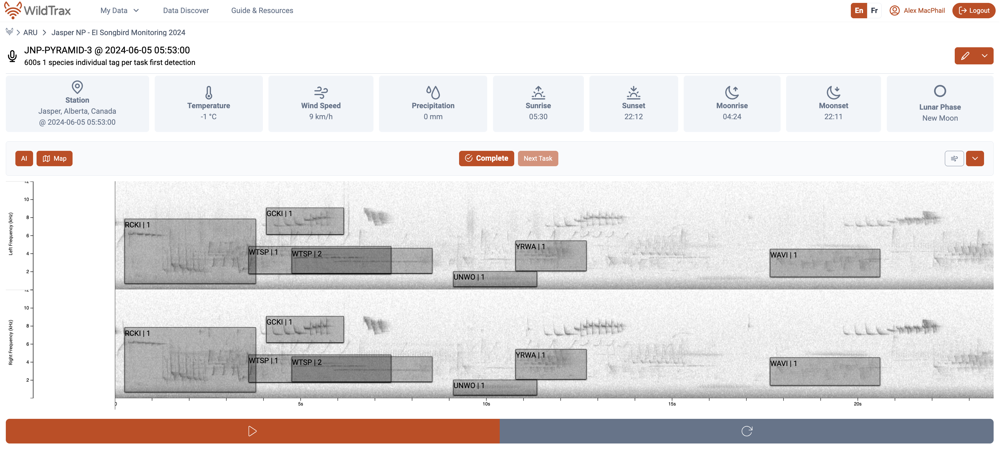
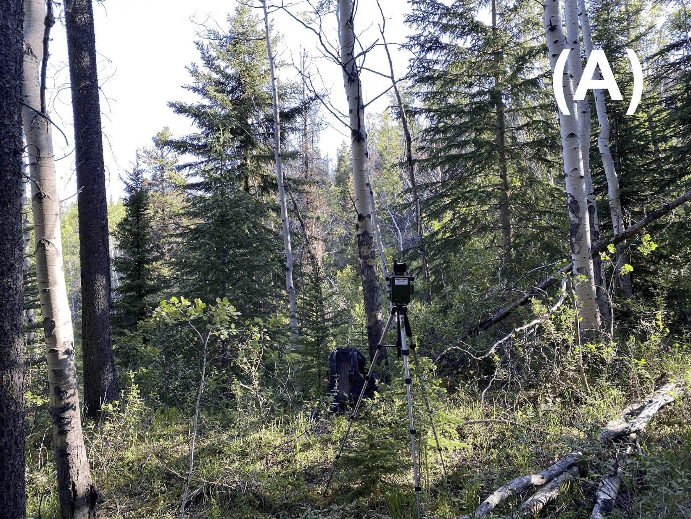
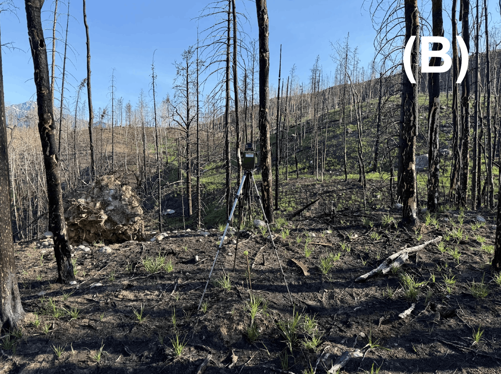

{style="float:left`;" fig-alt="Photo of Jasper" fig-align="center"}

```{r Download packages and load data}
#| include: false
#| echo: false
#| eval: true
#| warning: false
#| message: false

library(detect) # For svabu models
library(DT) # For nice data tables in the report
library(FD) # For functional diversity
library(fs) # For file reading
library(ggrepel) # For pushing text away from one another in multivariate plots
library(kableExtra) # For nice data tables in the report
library(leaflet) # For the map
library(lme4) # Linear mixed-models
library(modifiedmk) # Mann-Kendall and trend tests
library(patchwork) # For plotting graphs together
library(scales) # Scaling variables
library(segmented) # Breakpoint regressions
library(sf) # Spatial mapping
library(spdep) # Spatial dependence
library(tidytext) # Pretty text
library(tidyverse) # Universe of data wrangling functions (dplyr, purrr, tidyr, ggplot2)
library(vegan) # Multivariate data analysis
library(wildrtrax) # Environmental sensor data to and from WildTrax

# Authorize into WildTrax
wt_auth()

# Load the data
load('janp.RData')
#save.image('janp.RData')
```

```{r Download and join data together across methods and legacy data}
#| label: Download data from WildTrax
#| warning: false
#| message: false
#| echo: false
#| eval: false
#| include: true

# Download all Jasper multi-visit ARU projects - not used in current analysis for EI monitoring
janp_aru_projects <- wt_get_projects(sensor = 'ARU') |>
  filter(grepl('Jasper National Park', project)) |>
  dplyr::select(project_id) |>
  pull()

# All projects associated with a single-visit ARU deployment with no abundance cap
janp_0max <- wt_get_projects(sensor = 'ARU') |>
  filter(grepl('Jasper NP - EI', project)) |>
  filter(!grepl('2021|2022',project)) |>
  dplyr::select(project_id) |>
  pull()

# All projects associated with a single-visit ARU deployment with an abundance cap of 3
janp_3max <- wt_get_projects(sensor = 'ARU') |>
  filter(grepl('Jasper NP - EI', project)) |>
  filter(grepl('2021|2022',project)) |>
  dplyr::select(project_id) |>
  pull()

# List of all projects to download
janp_project_lists <- list(
  # multi_day = janp_aru_projects, # Remove multi-visit ARU monitoring
  single_visit_0_max = janp_0max,
  single_visit_3_max = janp_3max
)

# Download and bind all the data
janp_aru <- imap_dfr(
  janp_project_lists,
  ~ map_dfr(
      .x, 
      ~ wt_download_report(
          project_id = .x,
          sensor_id = "ARU",
          reports = "main"
        )
    ) |> mutate(data_type = .y, .after = organization) 
)

# Get all HawkEars detections
janp_hawkears <- imap_dfr(
  janp_project_lists,
  ~ map_dfr(
      .x, 
      ~ wt_download_report(
          project_id = .x,
          sensor_id = "ARU",
          reports = c("ai")
        )
    ) |> mutate(data_type = .y, .after = organization) 
)

# Clean up HawkEars
janp_hawkears_clean <- list(janp_hawkears |> mutate(year = year(recording_date_time)) |> filter(year > 2022) |> dplyr::select(-year), janp_aru |> mutate(year = year(recording_date_time)) |> filter(year > 2022) |> dplyr::select(-year))
janp_hawkears_eval <- wt_evaluate_classifier(janp_hawkears_clean, resolution = "task", remove_species = TRUE)
janp_hawkears_add <- wt_additional_species(janp_hawkears_clean, remove_species = T, threshold = 0.8, resolution = "task")

# Get weather data for recordings from WildTrax weather stations
rel_wea <- imap_dfr(
  janp_project_lists,
  ~ map_dfr(
      .x, 
      ~ wt_download_report(
          project_id = .x,
          sensor_id = "ARU",
          reports = "recording",
          max_seconds = 600
        )
    ) |> mutate(data_type = .y, .after = organization) 
)

# Get missing weather (bind this better somehow)
mis_wea <- read_csv("jasper2425.csv") |>
  rename(location = PointID) |>
  mutate(location = paste0(toupper(gsub(" .*", "", Transect)),"-",location)) |>
  mutate(recording_date_time = paste0(paste(Year, Month, Day, sep = "-")," ",Time), .after = location) |>
  mutate(recording_date_time = ymd_hms(recording_date_time)) |>
  dplyr::select(Year, location, Temperature, Sky, Wind) |>
  distinct() |>
  mutate(Sky = tolower(Sky))

# Bind legacy data with acoustic data
janp_main <- bind_rows(old_s_max, janp_aru) |>
  group_by(location) |>
  fill(ecoregion, .direction = "down") |>
  ungroup() |>
  mutate(location = case_when(grepl("^VALLEY-",location) ~ gsub("VALLEY-","VALLEY5-",location), TRUE ~ location),
         ecoregion = case_when(grepl("COTTONWOOD|MUSHROOM|VALLEY5",location) & is.na(ecoregion) ~ "Montane", TRUE ~ ecoregion),
         year = year(recording_date_time)) |>
  arrange(year, location, recording_date_time) |>
  left_join(mis_wea, by = c("year" = "Year", "location" = "location")) |>
  mutate(temperature = if_else(is.na(temperature), Temperature, temperature), 
         sky = if_else(is.na(sky), Sky, sky),
         wind = if_else(is.na(wind), Wind, wind)) |>
  group_by(location) |>
  fill(elevation, .direction = "down") |>
  group_by(location, year) |>
  fill(temperature, .direction = "down") |>
  fill(sky, .direction = "down") |>
  fill(wind, .direction = "down") |>
  ungroup() |>
  left_join(old_s_max_temps, by = c("location", "year")) |>
  mutate(temperature = if_else(is.na(temperature), temp, temperature), 
         sky = if_else(is.na(sky), sk, sky),
         wind = if_else(is.na(wind), wi, wind))

``` 

::: {.callout-note collapse="true" style="background-color: #f4f4f4; padding: 20px;"}
This report is dynamically generated, meaning its results may evolve with the addition of new data or further analyses. For the most recent updates, refer to the publication date and feel free to reach out to the authors.
:::

# Project Highlights

* Acoustic recordings from 2007–2025 in Jasper National Park were analyzed to assess bird abundance trends relative to a ±2.5% annual change threshold as part of the Park's ecological integrity monitoring program.
* A single-visit N-mixture model was applied to 31 alpine and 63 forested species, accounting for detection and observation covariates in each ecoregion.
* Long-distance migrants showed the strongest declines (60% alpine, 59% forested), followed by winter residents (33% alpine, 44% forested), while short-distance migrants were comparatively stable (24% alpine, 17% forested).
* Declines were most pronounced among invertebrate feeders (33% alpine, 44% forested) and plant/seed feeders (44% alpine, 23% forested), whereas omnivores were least affected (13% alpine, 25% forested).
* At finer dietary resolution, aerial insectivores exhibited the steepest declines (100% alpine [n=1], 67% forested), with additional losses among granivore-herbivores (63% alpine, 44% forested) and aquatic foragers (11% alpine, 20% forested), both based on small samples.
* Overall, declines are concentrated among long-distance migrants and species dependent on aerial insects and seeds, suggesting pressures on insect availability, phenology, and migratory connectivity across both mountain ecoregions.

# Land Acknowledgement

We respectfully acknowledge that Jasper National Park is located in Treaty 6 and 8 as well as the traditional lands of the Anishinabe, Aseniwuche Winewak, Dene-zaa, Nêhiyawak, Secwépemc, Stoney Nakoda, Mountain Métis and Métis. We acknowledge the past, present, and future generations of these nations who continue to steward the land.

# Introduction

Human activities are among the primary drivers of global forest wildlife declines, with habitat fragmentation and loss, climate change, and increased access to sensitive areas exerting compounding pressures on biodiversity — particularly in Canada's protected areas (@lemieux2011state; @fahrig2003effects; @hanski2011habitat; @mantyka2012interactions; @abrahms2023climate). In Alberta's Rocky Mountain Natural Region, these pressures are intensified by increasing wildfire activity, which has significantly affected montane bird communities. Declines in bird abundance across large regions of North America over recent decades (@rosenberg2019decline) underscore the need for systematic, park-wide monitoring.

In 2007, Jasper National Park established a long-term passive acoustic monitoring program to address a central question: has the abundance of forest and alpine birds declined over the duration of monitoring and during the past ten years? The program uses Autonomous Recording Units (ARUs), compact environmental sensors that passively capture vocalizing wildlife such as birds and amphibians (@aru-overview), a method growing rapidly in global use (@lots-of-pam). By enabling prolonged surveys with minimal human interference while producing a permanent, archiveable record of the soundscape, ARU-based monitoring is well suited to tracking ecological change at the scale of a national park.

Incidence-based metrics treat a single detection the same as a commonly observed species, obscuring ecologically meaningful differences in population status. Abundance fluctuates more than occurrence and is more directly linked to extinction risk, making it better suited for diagnosing decline and recovery and for capturing the resilience of biodiversity to ongoing environmental pressures. A species-specific decline threshold of 2.5% per year (approximately 20% over ten years) was applied throughout, consistent with the IUCN Vulnerable listing criteria and the Partners in Flight Conservation Urgency benchmark, under which species projected to lose 50% of their population within 30 years (~2.3% per year) are considered high urgency (@rosenberg2019decline).

This report analyzes Jasper's passive acoustic bird monitoring data from 2007 to 2025. Because birds serve as ecological indicators in both the forest and alpine ecosystems reported in Jasper's State of the Park Report, separate analyses were conducted for the forested ecoregion (encompassing the montane, lower subalpine, and upper subalpine ecoregions) and the alpine ecoregion. To enhance accessibility and reproducibility, findings are presented in this online report with fully documented code, supporting future updates as data collection methods become further standardized. Recommendations are also provided to refine transcription priorities, improve annual reporting workflows, and evaluate species guild classifications for long-term monitoring.

The objectives of this report are to:

* Describe the data management and processing procedures for acoustic data collected from 2007 to 2025.
* Compare how different data processing methods influence the count of species and individuals detected on recordings.
* Report on trends in bird abundance by species and by guild in the forest and alpine ecoregions, incorporating time-to-first-detection analysis.
  * Summarize results by ecoregion as the percentage of species and guilds declining by ≥2.5% in both forest and alpine regions.
  * Explore methods (e.g., inclusion of covariates and summarizing by guild) to interpret these changes, understanding how birds may be responding to stressors in the park or across their ranges and how changing populations may affect ecosystems. 
  * Estimate species richness and diversity trends to determine if they provide insight about bird community conditions.
* Provide recommendations for: 
  * Prioritizing previous years’ data for re-transcription to 1SPT; 
  * Optimizing annual reporting methods (e.g., baseline comparisons vs. 10-year trends); and 
  * Refining methods for evaluating species trends against thresholds and reviewing guilds and traits used in assessments.
  * Facilitate data publication to the public, resource managers, academic institutions, and any other relevant agencies.

# Methods

## Bird surveys

Monitoring for forest and alpine birds in Jasper National Park has been conducted annually since 2007 across a core set of 129 sites, with 20 sites that were added in 2025 after the Jasper 2024 fire (see @sec-jasper-fire). To ensure long-term feasibility, sites were clustered along transects, and transects were randomly selected from hiking trails that were at least 500 m away from roads and were at least five kilometers apart. To sample the diversity of birds in the park, transects were stratified by ecological region. Songbird data were collected using autonomous recording units (ARUs; @aru-overview) deployed by field staff to capture one 10-minute recording per point count annually. Surveys were scheduled consistently each breeding season in June and early July, starting 30 minutes before sunrise. Technicians walked transects containing nine or ten points, each spaced at least 300 m apart to prevent duplicate detections and ensure independence of locations (but see @sec-independent-locations). At each location, the ARU was set up, and technicians moved 10–20 m away to minimize disturbance, allowing at least 11 minutes of recording to capture voice notes and the standardized 10-minute survey period. Five covariates thought to influence detection or abundance were recorded: start time, wind speed (km/h), temperature (°C), cloud cover (overcast, broken, scattered, clear) and recording equipment. Recording equipment varied throughout the course of the study. During the 2021 and 2022 field seasons, paired recordings were collected concurrently at each site using both Wildlife Acoustics SM4 autonomous recording units and the original recording devices (Riverforks CZM or Zoom H2N Pro, depending on site-specific deployment). This dual-recording approach was implemented to support calibration and continuity across equipment types. However, to maintain consistency in data processing, only recordings from the original devices were transcribed and included in the final analyses for those years. Beginning in 2023, recordings were collected exclusively using SM4 units. 

::: {.callout-note collapse="true" style="background-color: #f4f4f4; padding: 20px;"}
The 2012 field season was reduced significantly and was not included in some of the subsequent analyses. Refer to @tbl-loc-summary for more information.
:::

```{r Spatial mapping}
#| echo: false
#| eval: false
#| warning: false
#| message: false
#| include: true

janp_shp <- read_sf("assets/National_Parks_and_National_Park_Reserves_of_Canada_Legislative_Boundaries.shp") |>
  filter(grepl("JASPER",adminAreaN))

janp_fire <- read_sf("./assets/JNP_FirePerimeters_selection.shp") |>
  st_transform(st_crs(janp_shp))

abfire <- read_sf("/users/alexandremacphail/downloads/abfire/WildfirePerimeters1931to2024.shp") |>
  st_transform(st_crs(janp_shp)) |>
  st_make_valid()
abfire <- abfire[!st_is_empty(abfire), ]

janp_utm <- janp_shp |> st_transform(26911)

abfire_utm <- abfire |>
  st_transform(26911)

abfire_utm <- abfire_utm |>
  st_make_valid() |>
  st_collection_extract("POLYGON")

idx <- lengths(st_intersects(abfire_utm, janp_utm)) > 0
fires_in_janp <- abfire_utm[idx, ] 
fires_in_janp <- fires_in_janp |> filter(!grepl('Chetamon',ALIAS)) |>
  filter(!YEAR == 2024)
fires_in_janp <- fires_in_janp |> st_transform(4326)

lc_150m <- read_csv("Habitat/LandCoverClass_Buffer150Raw.csv") |>
  pivot_longer(
    cols = matches("^LANDCOVER_(CODE|PCT)_"),
    names_to = c(".value", "rank"),
    names_pattern = "LANDCOVER_(CODE|PCT)_(\\d+)"
  ) |>
  rename(
    landcover = CODE,
    pct = PCT
  ) |>
  filter(!is.na(landcover), pct > 0) |>
  mutate(area_m2 = Shape_Area * (pct / 100)) |>
  group_by(Point_ID, landcover, VEGETATION_DENSITY, REFERENCE_YEAR) |>
  summarise(
    total_area_m2 = sum(area_m2, na.rm = TRUE),
    .groups = "drop"
  ) |>
  mutate(prop_cover = total_area_m2 / (pi * 150^2))

canopy_150m <- read_csv("Habitat/DomCanopy_Buffer150Raw.csv") |>
  group_by(Point_ID) |>
  mutate(buffer_area = sum(Shape_Area, na.rm = TRUE)) |>
  ungroup() |>
  group_by(Point_ID, DOM_LAYER_SPECIES_CODE) |>
  summarise(
    canopy_cover = sum(Shape_Area, na.rm = TRUE) / first(buffer_area),
    avg_height = mean(DOM_LAYER_HEIGHT, na.rm = TRUE)
  ) |>
  ungroup() |>
  rename(canopy_species = DOM_LAYER_SPECIES_CODE) |>
  mutate(
    canopy_species = if_else(is.na(canopy_species), "NC", canopy_species),
    mean_tree_height = if_else(is.na(avg_height) | is.nan(avg_height), 0, avg_height)
  )

understory_150m <- read_csv("Habitat/Understory_Buffer150Raw.csv") |>
  mutate(across(where(is.numeric), ~ na_if(.x, -99999))) |>
  drop_na() |>
  group_by(Point_ID) |>
  summarise(mean_shrub_height = mean(SHRUB_HEIGHT, na.rm = T),
            mean_shrub_crown_closure = mean(SHRUB_CROWN_CLOSURE, na.rm = T))

```

```{r Table of locations over time}
#| echo: false
#| eval: false
#| warning: false
#| message: false
#| include: true

janp_locs <- janp_main |>
  filter(year > 2022) |>
  dplyr::select(location, latitude, longitude, year, ecoregion) |>
  drop_na(latitude) |>
  distinct() |>
  sf::st_as_sf(coords = c("longitude", "latitude"), crs = 4326)

# Combine
janp_locs_map <- janp_locs |> 
  dplyr::select(location, year, ecoregion, geometry) |>
  mutate(ecoregion = case_when(
    grepl("^JANP", location) ~ "Other ARU Monitoring", 
    TRUE ~ ecoregion
  )) |>
  filter(!grepl('MPB',location))

fire_intersect <- st_intersects(janp_locs_map, janp_fire)

ysf <- janp_locs_map %>%
  mutate(
    FIRE_YEAR = sapply(fire_intersect, function(x) if(length(x)) janp_fire$FIRE_YEAR[x] else NA),
    Fire_Name = sapply(fire_intersect, function(x) if(length(x)) janp_fire$Fire_Name[x] else NA)
  ) |>
  filter(!is.na(FIRE_YEAR)) |>
  st_drop_geometry() |>
  mutate_at(vars(year, FIRE_YEAR), as.numeric) |>
  rowwise() |>
  mutate(yrs_since_fire = case_when(FIRE_YEAR > year ~ NA_real_,
                                    FIRE_YEAR == year ~ 0,
                                    FIRE_YEAR < year ~ year - FIRE_YEAR,
                                    TRUE ~ NA_real_))

# Generate summary table
janp_locs_table <- janp_main |>
  dplyr::select(location, year, ecoregion) |>
  distinct() |> 
  mutate(fill = 1) |>
  arrange(year) |>
  pivot_wider(names_from = year, values_from = fill, values_fill = 0) |>
  arrange(location)

```

```{r Map of locations}
#| echo: false
#| eval: true
#| warning: false
#| message: false
#| include: true
#| fig-align: center
#| fig-cap: Locations from Jasper National Park ARU EI Monitoring Program.
#| label: fig-aru-monitoring-locations

# Map visualization
pal <- colorFactor(
  palette = "Set3", 
  domain = janp_locs_map$ecoregion
)

fire_color <- "#C71585"  # You can adjust to a medium pink if you like

m <- leaflet() %>%
  addTiles() %>%
  addPolygons(
    data = janp_shp,
    color = "blue",
    weight = 1,
    fillOpacity = 0.2,
    popup = ~paste("Park:", adminAreaN)
  ) %>%
  addPolygons(
    data = fires_in_janp,
    fillColor = fire_color,
    color = fire_color,
    weight = 1,
    fillOpacity = 0.5,
    popup = ~paste("Fire:", ALIAS, "<br>Year:", YEAR),
    group = "Fires"   # group them for a single legend entry
  ) %>%
  addPolygons(
    data = janp_fire,
    fillColor = fire_color,
    color = fire_color,
    weight = 1,
    fillOpacity = 0.7,
    popup = ~paste("Fire: ", Fire_Name, "<br>Year:", FIRE_YEAR),
    group = "Fires"
  ) %>%
  addLegend(
    position = "bottomright",
    colors = fire_color,
    labels = "Fires",
    title = "Recent Fires",
    opacity = 1
  ) %>%
  addCircleMarkers(
    data = janp_locs_map,
    popup = ~paste("Location:", location, "<br>"),
    fillColor = ~pal(ecoregion),  
    fillOpacity = 1,
    color = "black", 
    radius = 6 
  ) %>%
  addLegend(
    "topright",
    pal = pal,
    values = janp_locs_map$ecoregion,
    title = "Ecoregion",
    opacity = 1
  ) %>%
  addMeasure(primaryLengthUnit = "meters", primaryAreaUnit = "sqmeters") %>%
  addMiniMap(position = "bottomleft")

if (knitr::is_html_output()) {
  m
} else {
  map_file <- "map_aru_locations.png"
  if (!file.exists(map_file)) mapview::mapshot2(m, file = map_file)
  knitr::include_graphics(map_file)
}

```

```{r Table of locations}
#| warning: false
#| echo: true
#| eval: true
#| message: false
#| include: true
#| label: tbl-loc-summary
#| collapse: true
#| code-fold: true
#| tbl-cap: Locations surveyed across years. Ones indicated a deployment in that year for that location.

datatable(janp_locs_table, 
          options = list(
            searching = TRUE,  
            paging = TRUE,    
            pageLength = 10   
          )) |>
  formatStyle(columns = colnames(janp_locs_table), 
              backgroundColor = styleEqual(c("NA"), "lightgray"))  
```

## Weather variables

To examine the influence of weather on species richness and abundance, species richness and abundance were modeled separately for each ecoregion using Poisson generalized linear models with richness and abundance as responses to temperature, cloud cover, wind, Julian day, and hour of day as predictors. In the alpine ecoregion, richness increased with temperature (β = 0.008, p = 0.03) and declined with wind (β = –0.019, p < 0.001) and hour (β = –0.053, p < 0.001), with additional reductions under clear and scattered sky conditions. In contrast, richness in the forested ecoregion was dominated by a pronounced seasonal decline (Julian day: β = –0.021, p < 0.001), alongside negative effects of wind (β = –0.031, p = 0.011) and hour (β = –0.027, p < 0.001); temperature had no detectable influence. Abundance showed minimal sensitivity to environmental variation; no predictors were significant in the alpine ecoregion, while in the forested ecoregion, only hour exerted a detectable negative effect (β = –0.045, p = 0.006). Temperature and wind were retained in abundance models due to their established influence on avian activity and detection, despite weak effects observed in these exploratory analyses.

```{r Relationship of weather variables with species abundance}
#| warning: false
#| echo: false
#| eval: false
#| message: false
#| include: false

### Prepare data for weather with each respective metric
janp_inds <- janp_main %>%
  mutate(ecoregion = case_when(ecoregion %in% c("Alpine") ~ "Alpine",
                               ecoregion %in% c("Upper Subalpine", "Lower Subalpine", "Montane") ~ "Forested")) |>
  mutate(hour = hour(recording_date_time), julian = yday(recording_date_time)) |>
  group_by(location, ecoregion, recording_date_time, julian, hour) %>%
  summarise(
    inds = max(individual_order),
    temperature = first(temperature),
    sky = first(sky),
    wind = first(wind),
    .groups = "drop"
  ) |>
  drop_na()

janp_richness <- janp_main %>%
  mutate(ecoregion = case_when(
    ecoregion %in% c("Alpine") ~ "Alpine",
    ecoregion %in% c("Upper Subalpine", "Lower Subalpine", "Montane") ~ "Forested"
  )) %>%
  mutate(hour = hour(recording_date_time), julian = yday(recording_date_time)) %>%
  group_by(location, ecoregion, recording_date_time, julian, hour) %>%
  summarise(
    richness = n_distinct(species_code),  # or whatever your species column is called
    temperature = first(temperature),
    sky = first(sky),
    wind = first(wind),
    .groups = "drop"
  ) %>%
  drop_na()

### Models and dispersion
mods_inds <- janp_inds |>
  group_split(ecoregion) |>
  map(~ glm(
    inds ~ temperature + sky + wind + julian + hour,
    data = .x,
    family = "poisson"
  ))

mods_rich <- janp_richness |>
  group_split(ecoregion) |>
  map(~ glm(
    richness ~ temperature + sky + wind + julian + hour,
    data = .x,
    family = "poisson"
  ))

deviance(inds_mod) / df.residual(inds_mod)
deviance(rich_mod) / df.residual(rich_mod)
summary(inds_mod)
summary(rich_mod)

### Weather plots

ggplot(janp_inds, aes(x = sky, y = inds)) +
  geom_boxplot() +
  facet_wrap(~ecoregion) +
  theme_bw()

ggplot(janp_inds, aes(x = temperature, y = inds)) +
  geom_point(alpha = 0.3) +
  facet_wrap(~ecoregion, scales = "free_x") +
  geom_smooth(method = "glm", method.args = list(family = "poisson")) +
  theme_bw() +
  xlab("Temperature (C)") + ylab("Maximum count of individuals")

ggplot(janp_inds, aes(x = wind, y = inds)) +
  geom_point(alpha = 0.3) +
  facet_wrap(~ecoregion, scales = "free_x") +
  geom_smooth(method = "glm", method.args = list(family = "poisson")) +
  theme_bw() +
  xlab("Wind (km/h)") + ylab("Maximum count of individuals")

ggplot(janp_richness, aes(x = temperature, y = richness)) +
  geom_point(alpha = 0.3) +
  geom_smooth(method = "glm", method.args = list(family = "poisson")) +
  facet_wrap(~ecoregion, scales = "free_x") +
  theme_bw() +
  xlab("Temperature (C)") + ylab("Species richness")

ggplot(janp_richness, aes(x = sky, y = richness)) +
  geom_boxplot() +
  facet_wrap(~ecoregion) +
  theme_bw()

```

## Vegetation variables

We used the existing Vegetation Resource Inventory (VRI; [REF]) derived from 2020 orthophoto imagery, before the 2022 Chetamon and 2024 Jasper Wildfire to describe habitat conditions. We extracted variables describing dominant land cover classes into groups which included conifer forest, broadleaf forest, mixedwood forest, shrub cover (low and tall subgroups), herbaceous (graminoid, mixed and forb subgroups), water (lake, river/stream), human (urban and road surface), and exposed soil classes (talus, exposed soil, bedrock), forest structure (mean canopy height, mean canopy cover), and understory characteristics (shrub height, mean shrub crown closure) at 150 meter radius around each location (@tbl-hab-var). To account for the severe habitat alteration caused by the 2024 Jasper Wildfire, we manually reclassified the land cover variable for all sites on the TEKARRA and VALLEY5 transects as simply "Burned" for the 2025 data. This classification replaced the pre-fire VRI categories (e.g., conifer, shrub) in the analysis. Assessment of the burn severity classification was not used in this analysis, but field visits and current knowledge would classify the burn as high to severe overall.

```{r Habitat variables}
#| warning: false
#| echo: true
#| eval: true
#| message: false
#| include: true
#| label: tbl-hab-var
#| collapse: true
#| code-fold: true
#| tbl-cap: Description of habitat variables used at each location in the Jasper National Park dataset.

hab_var <- janp_ready_trend |>
    select(location, ecoregion, landcover, VEGETATION_DENSITY, prop_cover,
           canopy_species, canopy_cover, avg_height, mean_tree_height,
           mean_shrub_height, mean_shrub_crown_closure) |>
    group_by(location, ecoregion) |>
    summarise(
        landcovers = paste(unique(paste(landcover, VEGETATION_DENSITY, sep=" / ")), collapse="; "),
        canopy_species = paste(unique(canopy_species), collapse=", "),
        across(c(canopy_cover, avg_height, mean_tree_height,
                 mean_shrub_height, mean_shrub_crown_closure), mean, na.rm=TRUE),
        .groups = "drop"
    ) |>
  mutate(ecoregion = case_when(ecoregion %in% c("Alpine") ~ "Alpine", ecoregion %in% c("Upper Subalpine", "Lower Subalpine", "Montane") ~ "Forested"))
  
  
datatable(hab_var) |>
  formatRound(columns = names(hab_var)[sapply(hab_var, is.numeric)], digits = 2)

```

## Data management, processing and quality control

Recordings were clipped and organized to only include the 10-minute count. Before adopting [WildTrax](https://wildtrax.ca) in 2021, processing analysts excluded the initial 20 seconds to 1.5 minutes of recordings to reduce human impact on detection probability, then logged the first detection time per species. Recordings are now uploaded as clean 10-minute files with the voice note and observer notes removed. In WildTrax, individuals were counted by users scanning both the spectrogram and listening to the audio output (@MacPhail2026_avian). Tags of each species-individual were drawn to encompass each signal (@fig-acousticprocessing). Transcribers also had locations photos available to optimize their species identification by having habitat context while processing. To ensure comparability across the 18-year dataset, we harmonized the abundance metrics derived from the differing transcription protocols prior to analysis. For legacy data collected between 2012 and 2020 using the 3-minute interval method, we calculated abundance as the maximum count observed in any single time bin rather than summing across bins. This conservative approach prevents the double-counting of individuals that sing continuously throughout the recording. Conversely, for data processed or re-transcribed using the modern 1SPT protocol (time of first detection of each unique individual of each species; 2007–2011 and 2021–2025), abundance was defined as the total count of unique individuals detected over the full 10-minute duration. Specifically, in WildTrax maximum count of individuals was used (i.e. AMRO1, AMRO2, AMRO3 max of 3 represents 3 individuals total).

```{r Transcription method table}
#| warning: false
#| echo: true
#| eval: true
#| message: false
#| include: true
#| label: tbl-transcriptions
#| collapse: true
#| code-fold: true
#| tbl-cap: Transcription methods by year (2007–2025). Historical data (2007–2020) are undergoing re-transcription to align with the standardized protocol used from 2021 onwards.

transcription_table <- tibble(
  Years = c("2012-2020", "2021-2022", "2007-2011, 2023-2025"),
  `Transcription Method` = c(
    "3 Bins, abundance calculated from the bin with the highest count by species",
    "Every new individual is tagged but cap of max 3 individuals.",
    "Every new individual is tagged, no cap on abundance."
  )
)

# Render the datatable
datatable(transcription_table,
          options = list(
            searching = TRUE,
            paging = TRUE,
            pageLength = 10
          )) |>
  formatStyle(columns = colnames(transcription_table),
              backgroundColor = styleEqual(c("NA"), "lightgray"))

```

{#fig-acousticprocessing .float-left .fig-align-center}

```{r Verified tags}
#| warning: false
#| echo: false
#| message: false
#| eval: true
#| include: true

all_tags <- janp_main |>
  tally() |>
  pull()

verified_tags <- janp_main |>
  group_by(tag_is_verified) |>
  tally() |>
  ungroup() |>
  mutate(Proportion = round(n / all_tags,4)*100) |>
  rename("Count" = n) |>
  rename("Tag is verified" = tag_is_verified)

```

```{r Too many to count tags}
#| warning: false
#| echo: false
#| message: false
#| eval: true
#| include: false

tmtt_tags <- janp_main |>
  dplyr::select(location, recording_date_time, species_code, abundance) |>
  distinct() |>
  filter(abundance == "TMTT") |>
  mutate(recording_date_time = format(recording_date_time, "%Y-%m-%d %H:%M:%S"))

```

{#fig-visitphotos .float-left .fig-align-center}
Simultaneously, we evaluated the performance of two acoustic classifiers, HawkEars v.1.0.8 (@huus2025hawkears) and BirdNET v2.1 and Lite (@kahl2021birdnet), on the acoustic recordings (@fig-classifier). Across the recall range, BirdNET-Lite maintained the highest precision, with BirdNET v2.1 closely tracking but consistently lower. HawkEars v1.0.8 performed well at low recall but declined rapidly as recall increased. At low recall, all models exceeded 0.9 precision, with BirdNET-Lite marginally leading. Performance converged at intermediate recall (~0.6–0.75), where precision ranged from ~0.75–0.8. At high recall (>0.8), differences widened: BirdNET-Lite degraded most gradually, BirdNET v2.1 declined more steeply, and HawkEars showed a sharp drop in precision. Overall, BirdNET-Lite demonstrated the most favourable precision–recall tradeoff, particularly under high-recall conditions where false positives increase.

```{r HawkEars and BirdNET performance}
#| warning: false
#| echo: false
#| message: false
#| eval: true
#| include: true
#| code-fold: true
#| label: fig-classifier
#| fig-cap: Performance of each acoustic classifier on the Jasper dataset.

ggplot(janp_hawkears_eval) +
  geom_smooth(aes(x=recall, y=precision, colour=classifier), linewidth=1.5) +
  xlab("Recall") +
  ylab("Precision") +
  xlim(0,1) +
  ylim(0,1) +
  theme_bw() +
  scale_colour_viridis_d(option = "cividis")
```


## Analytical methods

::: {.callout-note collapse="true" style="background-color: #f4f4f4; padding: 20px;"}
For the purpose of these analyses, abundance was defined as the count of individuals detected during point counts, rather than as a density x area relationship. All analyses took place in R 4.5.3 ‘Reassured Reassurer’.
:::

Our analysis proceeded in the following steps. We:

1. Assessed if the new montane sites were effective reference sites for the montane;
2. Evaluated consistency in species identification and abundance estimates across transcription methods and observers;
3, Selected species and grouped species by guild for trend analysis;
4. Characterized community composition by the alpine and forest ecoregions;
5. Examined the initial effect of the 2025 Jasper Wildfire on bird community composition;
6. Modeled temporal changes in functional and community-level diversity; and
7. Quantified long-term abundance trends (2007–2025), accounting for detection probability and addressing spatial autocorrelation.

### Location correlation {#sec-independent-locations}

To inform our subsequent modeling choices, we first evaluated the bird survey data for spatial autocorrelation, in other words, whether survey points close to one another exhibit similar bird counts. To test for this, we calculated a total abundance index for each location and year by summing the maximum number of individuals detected, representing the minimum number of individuals known to be present. Because survey points were typically spaced 300 m apart, we defined spatial neighbor relationships using a 1-nearest-neighbor approach (*k* = 1) based on great-circle distances. We derived spatial coordinates from geographic point data, excluding non-finite values to ensure valid estimation. Using the `spdep` R package (@spdeppackage), we constructed a spatial weights matrix with row-standardized weights to reflect immediate adjacency between points. We assessed global spatial autocorrelation in total abundance using Moran’s *I* (@bivand2018comparing) under a randomization assumption. This statistic evaluates whether the landscape is spatially structured—specifically, whether nearby locations tend to have similar abundance values more often than expected by chance. To determine if this dependence was driven by localized clustering, we further calculated Local Indicators of Spatial Association (LISA) using local Moran’s *I* (@anselin1995local) which allowed for the identification of potential high–high, low–low, and spatial outlier patterns, with statistical significance evaluated at *α* = 0.05. While global Moran’s *I* indicated significant positive spatial autocorrelation across the study area, local Moran’s *I* revealed no statistically significant clusters. This pattern suggests that similarities in bird counts among nearby survey locations were spread broadly rather than concentrated in distinct hotspots, consistent with spatial dependence arising from gradual, landscape‑scale ecological processes rather than localized aggregations. Therefore, we proceeded by treating the locations as spatially independent.

```{r List of transects}
#| warning: false
#| echo: false
#| message: false
#| eval: false
#| include: true
#| code-fold: true

# Create an object that defines the EI transects
janp_transects <- janp_main |>
  filter(!grepl('^JANP|^MPB',location)) |>
  filter(data_type %in% c("legacy","single_visit_3_max","single_visit_0_max")) |>
  filter(!(data_type == "single_visit_0_max" & year < 2023)) |>
  wt_tidy_species(remove = c("mammal","amphibian","abiotic","insect","unknown"), zerofill = F) |>
  dplyr::select(location) |>
  distinct() |>
  separate(location, into = c("transect_name", "station_id"), remove = FALSE)

```

```{r Function to run spatial independence test}
#| warning: false
#| echo: false
#| message: false
#| eval: true
#| include: true

# Function to run spatial test - output is a map of significant and non-significant clusters and their direction; also includes table of non-indepedent location as well as the Global Moran's I
run_spatial_tests <- function(input) {
  
  input <- janp_main

janp_total_count <- janp_main %>%
  wt_tidy_species(remove = c("mammal","amphibian","abiotic","insect","unknown"), zerofill = T) |>
  group_by(location, ecoregion, year, species_code) %>%
  summarise(n = max(individual_order, na.rm = TRUE)) |>
  ungroup()

janp_locs_sf <- janp_locs %>%
  distinct(location, ecoregion, geometry) %>%
  inner_join(janp_total_count, by = "location") %>%
  st_as_sf()

janp_locs_sf <- janp_locs_sf %>%
  mutate(n = as.numeric(n)) %>%
  filter(!is.na(n))

janp_clean <- janp_locs_sf |>
  mutate(n = ifelse(is.finite(n), n, NA_real_)) |>
  filter(!is.na(n)) |>
  ungroup()

coords <- st_coordinates(janp_clean)

neighbours <- knn2nb(
  knearneigh(coords, k = 1, longlat = TRUE)
)

weights <- nb2listw(
  neighbours,
  style = "W",
  zero.policy = TRUE
)

moran_test <- moran.test(
  janp_clean$n,
  listw = weights,
  zero.policy = TRUE
)

lisa <- localmoran(
  janp_clean$n,
  listw = weights,
  zero.policy = TRUE
)

janp_lisa_sf <- janp_clean |>
  ungroup() |>
  mutate(
    Ii      = lisa[, "Ii"],
    z_Ii    = lisa[, "Z.Ii"],
    p_Ii    = lisa[, "Pr(z != E(Ii))"]
  )

lag_n <- lag.listw(weights, janp_clean$n, zero.policy = TRUE)

janp_lisa_sf <- janp_lisa_sf |>
  mutate(
    n_std     = scale(n)[, 1],
    lag_n_std = scale(lag_n)[, 1],
    lisa_type = case_when(
      n_std > 0 & lag_n_std > 0 & p_Ii <= 0.05 ~ "High–High",
      n_std < 0 & lag_n_std < 0 & p_Ii <= 0.05 ~ "Low–Low",
      n_std > 0 & lag_n_std < 0 & p_Ii <= 0.05 ~ "High–Low",
      n_std < 0 & lag_n_std > 0 & p_Ii <= 0.05 ~ "Low–High",
      TRUE                                     ~ "Not significant"
    )
  )

lisa_map <- ggplot(janp_lisa_sf) +
  geom_sf(aes(fill = lisa_type), color = "grey30", shape = 21, size = 3) +
  scale_fill_manual(
    values = c(
      "High–High"       = "#d7191c",
      "Low–Low"         = "#2c7bb6",
      "High–Low"        = "#fdae61",
      "Low–High"        = "#abd9e9",
      "Not significant" = "grey85"
    )
  ) +
  labs(
    fill = "LISA cluster",
    title = "Local Moran’s I (LISA) cluster map"
  ) +
  theme_minimal() +
  facet_wrap(~lisa_type, ncol = 2) +
  scale_x_continuous(breaks = scales::breaks_pretty(n = 3))

lisa_summary <- janp_lisa_sf %>%
  st_drop_geometry() |>
  group_by(location) %>%
  summarise(
    mean_Ii = mean(Ii, na.rm = TRUE),
    mean_z = mean(z_Ii, na.rm = TRUE),
    prop_significant = mean(p_Ii < 0.05, na.rm = TRUE)
  ) |>
  filter(prop_significant > 0.5)

return(lisa_map)

}

run_spatial_tests()

```

### New reference site comparisons

The 2024 Jasper Wildfire severely burned two established acoustic transects (VALLEY5 and TEKKARA). While 41% of the montane (valley-bottom) forest has burned since 2023, two of three transects in this ecoregion were severely burned. The remaining transect is scheduled for Wildfire Risk Reduction treatment. To continue to monitor bird communities in unburned/untreated montane forest, we added two new reference transects in 2025 in the montane (COTTONWOOD and MUSHROOM), and we plan to continue to monitor all transects moving forward. We selected these new transects using Vegetation Resource Inventory data, identifying sites across the montane ecoregion with landcover types that matched the pre-fire dominant land cover types of the burned transect. Final transect placement followed the original sampling design criteria.

To assess whether the new transects were appropriate references for montane transects, we evaluated how similar their species assemblages were to those observed at existing montane transects over the past three years (2023-2025), excluding the TEKARRA and VALLEY5 transects post-fire because these were expected to diverge substantially due to fire severity. Specifically, we compared species detections from the COTTONWOOD and MUSHROOM transects to the distribution of detections across all other montane points to quantify compositional similarity and departure from the montane baseline. Representativeness of control transects was assessed using a multivariate dispersion analysis (PERMDISP) based on Bray–Curtis dissimilarity, with distances of new transects to the montane centroid compared against the distribution of distances among established montane transects. Statistical significance of differences in dispersion was evaluated using a permutation test with 999 iterations.


::: {.figure-grid}
{width=48%}
{width=48%}

Tekarra 9 site photos views from 2024 (A) pre-fire, and 2025 (B) post-fire. 
:::

### Transcription observer comparisons

Transcription methods varied (@tbl-transcriptions) over time. Recordings from 2007 to 2020 were classified by a small number of repeat observers (legacy), while subsequent data were classified by a random selection from many observers (WildTrax). To evaluate consistency between the legacy dataset and the modern WildTrax workflow, we analyzed a subset of recordings processed using both approaches. This included re-processed legacy recordings that 1) enabled total abundance estimates and 2) used new observers in WildTrax, allowing for direct comparison of individual observer performance between the legacy and modern protocols. For each dual-processed recording, we derived the maximum count of individuals per species identified by each specific observer. We used two different metrics to verify data continuity. First, we calculated pairwise Pearson correlations between observers to quantify consistency in abundance estimates and identify systematic deviations in counts. Second, to evaluate consistency in species detection (composition), we binarized the data to presence/absence and calculated Bray–Curtis dissimilarities between individual observers. We then applied hierarchical clustering to these dissimilarity scores to verify that the transition to WildTrax did not introduce observer-specific biases in species identification or community composition.

### Selection of species and guilds for trend analysis

```{r Select species to include in further trend analysis}
#| warning: false
#| echo: false
#| message: false
#| eval: false
#| include: true

species_select <- janp_main |>
  mutate(species_code = case_when(species_code == "VESP" ~ "FOSP", TRUE ~ species_code)) |>
  filter(!(species_code %in% c("NONE","DOGG","HOMA","UROPAR","HORS","VIRA"))) |>
  filter(!(grepl('^Unidentified',species_common_name))) |>
  group_by(species_code) |>
  tally() |>
  inner_join(wt_get_species() |> dplyr::select(species_code, species_common_name, species_order, species_class) |> distinct())

jmc <- janp_main |> mutate(ecoregion = case_when(ecoregion %in% c("Alpine") ~ "Alpine",
                               ecoregion %in% c("Upper Subalpine","Lower Subalpine","Montane") ~ "Montane")) |> inner_join(wt_get_species() |> select(species_code, species_order, species_class), by = "species_code") |> filter(species_class == "AVES", !grepl('^UN',species_code), !species_code %in% c("UGRS","UPCH","UCRS","UCTH","UGOL")) |> group_by(ecoregion) |> summarise(n = n_distinct(species_code))

```

The monitoring program dataset produced detections for `r jmc$n[jmc$ecoregion == "Alpine"]` alpine and `r jmc$n[jmc$ecoregion == "Montane"]` montane species. Following recommendations to prioritize species with sufficient statistical power (@prowse2021optimising), we restricted our analysis to native terrestrial bird species for which: (a) Jasper National Park is their breeding range; and (b) the total count across all point count sites exceeded 20 individuals (see @tbl-guilds). Applying these criteria resulted in a final list of `r nrow(trendzz)` focal species. This selection process retained `r round((nrow(janp_main |> filter(species_code %in% trendzz_spp)) / nrow(janp_main))*100,2)`% of all individual detections recorded by the program, ensuring that the analysis captured the vast majority of the biological signal while removing rare or vagrant species that would destabilize trend estimates.

To assess trends in species’ abundances and interpret community-level ecological responses, we assigned species to guilds. Guilds are groups of species that respond in similar ways to environmental changes as a result of similar uses of the environment (@doser2021trends). Directional trends in abundant species can strongly influence the trend of the guilds of which these species are members. Given this limitation, trend analyses of ecological guilds often warrant further examination of common patterns of change among species within the guild.  For example, if we find large variation in abundance trends across an ecoregion but not across bird guilds, this may suggest a consistent effect on the entire bird community (@doser2021trends, which can determine if management should target a whole community, specific guilds or individual species. If all or many species within a guild show similar trends in relative abundance, then factors affecting the guild-related life history attributes deserve attention. @pacifici2014guidelines recommend using bird guilds in post-hoc assessment. Species were assigned to guilds using the [Birds of North America](https://birdsna.org), [Elton Traits Database](https://esajournals.onlinelibrary.wiley.com/doi/10.1890/13-1917.1) and bird guidebooks. To examine responses by different guild types we assigned birds by migratory guild (long-distance migrant, short-distance migrant, winter resident), Elton trait (e.g., invertebrate, plant/seed, omnivore), dietary guild (e.g., aerial insectivore, bark forager), and habitat guild (e.g., wetland, forest generalist, late successional forest) (@tbl-guilds).

### Ecoregion community composition analysis

To characterize bird community composition, we aggregated species-level observations into a species-by-location matrix, populated with the maximum count of each species at each location. Survey points were then classified into two primary ecoregions: alpine and forested. For the purpose of this analysis, the forested category served as a broad aggregate, grouping the upper subalpine, lower subalpine, and montane ecoregions into a single unit that refers to high elevation habitat below and near treeline. We quantified the variation in community composition explained by these two ecoregions using Redundancy Analysis (RDA) in the `vegan` package (@vegan2025) and visualized species–ecoregion relationships with ordination plots (@Rao1964). Finally, to test for statistical differences in composition between the Alpine and Montane groups, we performed a permutational multivariate analysis of variance (PERMANOVA; @Anderson2001). This test was conducted on Bray–Curtis dissimilarities using 999 permutations under a reduced model.

### Functional and community-level diversity

To evaluate community-level ecological responses, we examined temporal changes in three complementary diversity metrics: functional diversity, species richness, and community structure. First, we quantified functional diversity using Rao’s Q (@rao1982diversity; @laliberte2010adistance), calculated via the `dbFD()` function in the `FD` package (@FDpackage). This metric estimates the average difference in functional traits between any two random individuals in the community. We also calculated species richness (number of unique species per location per year) and Shannon’s diversity index (@shannon1948mathematical), which integrates richness and evenness to describe community structure. These metrics were modeled through time using linear, mixed-effects, and segmented regression models to detect both gradual and threshold-type changes. Results were summarized graphically by ecoregion and functional guild to highlight spatial variation in diversity trajectories.
 
```{r Create a guild table}
#| warning: false
#| echo: false
#| eval: true
#| message: false
#| include: true
#| label: tbl-guilds
#| collapse: true
#| code-fold: true
#| tbl-cap: Guilds

guilds <- read_csv("./assets/jasper_guilds.csv")

datatable(
  guilds |> 
    left_join(
      janp_main |> group_by(species_code) |> tally(), 
      by = "species_code"
    ) |>
    replace_na(list(n = 0)) |>
    relocate(n, .after = species_code), 
  options = list(
    searching = TRUE,  
    paging = TRUE,    
    pageLength = 10   
  )
)

```

```{r Run functional diversity analysis}
#| warning: false
#| echo: false
#| eval: true
#| message: false
#| include: true
#| code-fold: true

abund_sp <- janp_main %>%
  filter(ecoregion %in% c("Alpine")) |>
  filter(!grepl('COTTONWOOD|MUSHROOM', location)) |>
  group_by(location, year, species_code) %>%
  summarise(abund = n(), .groups = "drop") %>%
  pivot_wider(id_cols = c(location, year),
              names_from  = species_code,
              values_from = abund,
              values_fill = 0)

trait_df <- guilds %>%
  dplyr::select(species_code, trait, dietary_guild, habitat_guild, migratory_guild) %>%
  distinct() %>%
  column_to_rownames("species_code")

trait_mat <- model.matrix(~ trait + dietary_guild + habitat_guild + migratory_guild - 1,
                          data = trait_df)

a_mat <- abund_sp %>% dplyr::select(-location, -year) %>% as.matrix()

common <- intersect(colnames(a_mat), rownames(trait_mat))
a_mat2     <- a_mat[, common, drop = FALSE]
trait_mat2 <- trait_mat[common, , drop = FALSE]

nonzero   <- rowSums(a_mat2) > 0
a_mat3    <- a_mat2[nonzero, , drop = FALSE]
sites3    <- abund_sp[nonzero, c("location","year")]

fd <- dbFD(x = trait_mat2, a = a_mat3, calc.FRic = TRUE, calc.CWM = FALSE, messages = FALSE)

loc_year_rao <- sites3 %>%
  mutate(RaoQ = fd$RaoQ)

yearly_rao <- loc_year_rao %>%
  group_by(year) %>%
  summarise(meanRao = mean(RaoQ), .groups = "drop")

mk        <- mmkh(yearly_rao$meanRao, ci = 0.95)
lm_trend  <- lm(meanRao ~ year, data = yearly_rao)
mix_trend <- lmer(RaoQ ~ year + (1|location), data = loc_year_rao)
seg       <- segmented(lm(meanRao ~ year, data = yearly_rao), seg.Z = ~ year)

aic_values <- tibble(
  model = c("Linear", "Mixed", "Segmented"),
  aic   = c(AIC(lm_trend), AIC(mix_trend), AIC(seg))) |>
  arrange(aic)

aic_values <- aic_values |>
  mutate(
    delta = aic - min(aic),
    weight = exp(-0.5 * delta) / sum(exp(-0.5 * delta))
  )

yearly_rao <- yearly_rao |>
  mutate(
    lm_fit = predict(lm_trend, newdata = yearly_rao),
    mix_fit = predict(mix_trend, newdata = yearly_rao, re.form = NA),
    seg_fit = predict(seg, newdata = yearly_rao)
  )

```

```{r Run Shannon Diversity}
#| warning: false
#| echo: false
#| eval: true
#| message: false
#| include: true

shannon_d <- janp_main |> 
  filter(!grepl('COTTONWOOD|MUSHROOM', location)) |>
  mutate(ecoregion = case_when(ecoregion %in% c("Alpine") ~ "Alpine",
                               ecoregion %in% c("Upper Subalpine","Lower Subalpine","Montane") ~ "Forested")) |>
  wt_tidy_species(remove = c("mammal","amphibian","abiotic","insect","unknown"), zerofill = F) |>
  inner_join(wt_get_species() |> dplyr::select(species_code, species_class, species_order), by = "species_code") |>
  dplyr::select(location, ecoregion, recording_date_time, species_code, species_common_name, individual_order, abundance) |>
  distinct() |>
  group_by(location, ecoregion, recording_date_time, species_code, species_common_name) |>
  summarise(count = max(individual_order)) |>
  ungroup() |>
  pivot_wider(names_from = species_code, values_from = count, values_fill = 0) |>
  pivot_longer(cols = -(location:species_common_name), names_to = "species", values_to = "count") |>
  group_by(location, ecoregion, year = year(recording_date_time), species) |>
  summarise(total_count = sum(count)) |>
  ungroup() |>
  group_by(location, ecoregion, year) |>
  summarise(shannon_index = diversity(total_count, index = "shannon")) |>
  ungroup() |>
  filter(!(year == 2012 & ecoregion == "Forested"))

shannon_d$year_c <- shannon_d$year - mean(shannon_d$year)
shannon_d$ecoregion <- factor(shannon_d$ecoregion, levels = c("Alpine", "Montane"))

spp_rich_location <- janp_main |>
  filter(!grepl('COTTONWOOD|MUSHROOM', location)) |>
  filter(data_type %in% c("legacy","single_visit_3_max","single_visit_0_max")) |>
  filter(!(data_type == "single_visit_0_max" & year < 2023)) |>
  wt_tidy_species(remove = c("mammal","amphibian","abiotic","insect","unknown"), zerofill = F) |>
  dplyr::select(location, year, species_code) |>
  distinct() |>
  group_by(location, year) |>
  summarise(species_count = n_distinct(species_code)) |>
  ungroup() |>
  left_join(janp_locs_table |> dplyr::select(location, ecoregion), by = "location") |>
  mutate(ecoregion = case_when(ecoregion %in% c("Alpine") ~ "Alpine",
                               ecoregion %in% c("Upper Subalpine","Lower Subalpine","Montane") ~ "Montane")) |>
  filter(!(year == 2012 & ecoregion == "Montane"))

# spp_rich_location$year_c <- spp_rich_location$year - mean(spp_rich_location$year)
# spp_rich_location$ecoregion <- factor(spp_rich_location$ecoregion, levels = c("Alpine", "Montane"))
# spp_rich_mod <- lmer(species_count ~ year_c + ecoregion + (1|location), data = spp_rich_location)
# summary(spp_rich_mod)
```

### Jasper 2024 fire effects {#sec-jasper-fire}

We characterized the shift in bird community composition on the VALLEY5 and TEKARRA transects using redundancy analysis (RDA). We constructed a species-by-site community matrix using maximum abundance counts, restricting the pre-fire baseline to data from the montane ecoregion collected over the three years prior to the wildfire (2022–2024). We then modeled community structure as a function of fire period (pre-fire vs. post fire). This constrained ordination allows us to quantify the variation in species assemblages explicitly explained by the fire event and visualize the directional responses of individual species

### Trend analysis

To quantify temporal changes in bird populations and community composition from 2007 to 2025, we analyzed trends in species-specific abundance, in forest and alpine ecoregions separately, and grouping species by functional guilds. Analyses were designed to separate biological change from potential sampling and methodological effects, ensuring that observed patterns represented genuine ecological responses. This was achieved through a multi-step framework that (1) evaluated and modeled detection probability and methodological variability, (2) estimated detection-corrected abundance, and (3) evaluated long-term directional trends and associated shifts in functional and community-level diversity.


#### Detection-corrected abundance estimation

Abundance was estimated using single-visit *N*-mixture abundance models implemented in the `detect::svabu()` function (@solymos2012conditional). This framework jointly models site-level abundance with observation and detection probability from single-visit counts as conditional likelihood estimates. The package and framework make it easy for users to add and interpret observation and detection covariates which supports logistical considerations for single-visit surveys. We first stratified analyses by ecoregion (alpine vs. forested), fitting separate detection-abundance models given the assumption site characteristics and ecological drivers are different in both ecoregions. Expected abundance per site visit was modelled using the latent abundance component (λ).

#### Alpine model structure

For alpine model selection, we constructed a candidate model set incorporating observation and detection covariates performed model selection ranked via BIC, which applies a stronger penalty for model complexity than AIC and is appropriate for large candidate model sets (). We also determined distribution and zero-inflation of each set of variables for the species and assigned the appropriate type to the species in the alpine ecoregion, noting zero-inflated distribution for most species. We examined the use of scaled variables for year (to detect temporal abundance trends), elevation, and previously mentioned habitat and landcover variables. Mean tree height and mean shrub height were used as structural vegetation covariates and were included as potential predictors of both abundance and detectability. Julian date, hour, detection time, data type were also included as detection covariates. Prior to model fitting, correlations between cover and height variables were assessed to evaluate collinearity. Conifer cover and mean tree height were moderately correlated (*r* = 0.38), while shrub cover and mean shrub height were essentially uncorrelated (*r* = 0.07), indicating that cover and height capture independent dimensions of habitat structure. For example, an alpine site may have high shrub cover composed of low-growing dense vegetation, or sparse but structurally tall shrubs, attributes that may be ecologically distinct and potentially relevant to different species. Model selection via BIC identified mean tree height as the primary variable influencing detection probability, with taller vegetation reducing detectability, while abundance was best explained by a combination of vegetation cover types and temporal trend. Variation inflation factors were simultaneously calculated for all landcover covariates included in the abundance submodel to assess collinearity.

* **Abundance submodel (log link):** log(λ) = β₀ + β₁(year_c) + β₂(Shrub) + β₃(Conifer) + β₄(mean_tree_height) + β₅(mean_shrub_height)
* **Detection submodel (logit link):** logit(p) = α₀ + α₁(temperature) + α₂(mean_tree_height) + α₃(wind) + α₄(data_type) + α₅(detection_time)

#### Forested model structure

In the forest model selection, the candidate model set was again ranked via BIC but included the following ecoregion-specific variables: scaled variables for year, shrub cover, conifer cover, broadleaf cover, mixedwood cover, water cover, human (urban and road surface), herbaceous cover (graminoid, mixed and forbs), and rock and soil (bedrock, exposed soil). The burned class exclusive to TEKARRA and VALLEY5 locations in 2025 was added to models but created complexity in the models by variance inflation factor testing.

* **Abundance submodel (log link):** log(λ) = β₀ + β₁(year_c) + β₂(Conifer) + β₃(Broadleaf) + β₄(Mixedwood) + β₅(mean_tree_height) + β₆(mean_shrub_height)
* **Detection submodel (logit link):** logit(p) = α₀ + α₁(temperature) + α₂(wind) + α₃(julian) + α₄(hour) + α₅(detection_time) + α₆(data_type) + α₇(mean_tree_height) + α₈(canopy_cover)
 
#### Percent change evaluation

Temporal trends were quantified using the modified Mann-Kendall test (@mann1945non; @hamed2009), which includes variance correction for autocorrelation between years, and detects monotonic directional change, and Sen’s Slope (@Sen01121968), which estimates the magnitude of those trends. Both tests were implemented via the `modifiedmk` package (@hamed1998) and applied to the detection-corrected abundance estimates (λ̂). Sen’s slope provides an estimate of the median annual rate of change in the abundance index over the time series. To express this rate in a standardized and interpretable way, we converted Sen’s slope to a percent change per year by dividing the estimated slope by the mean annual abundance index across the full time series and multiplying by 100. This metric represents the average proportional change in abundance per year, relative to the long-term mean abundance of the species in that ecoregion. Positive values indicate increasing abundance, while negative values indicate declining abundance. We quantified this percent change as both an annual change in the mean abundance as well as the percentage change across the entire time period. We also quantified annual abundance trends within each ecoregion, grouped by functional guild: diet guild (frugivore, nectarivore, insectivore, omnivore, granivore, and vertebrate-fish-scavenger), habitat guild (forest generalist, habitat generalist, wetland, late-successional forest, and grassland-shrubland-alpine), and migratory guild (long-distance migrant, short-distance migrant, and winter resident).

#### Climate-trend evaluation

Abundance estimates (λ̂) were joined with species-level migratory guild classifications and site-level climate data by location and year. Migratory guild labels were standardized prior to analysis. Data were aggregated to the year × ecoregion × migratory guild level by calculating mean abundance (λ̂) and mean climate variables, including spring temperature Tave), precipitation metrics, and associated anomalies. To facilitate comparison of temporal trends, variables were standardized (z-scored) within the full dataset. Scaled abundance and temperature were visualized over time using linear model fits within each guild–ecoregion combination. To quantify climate–abundance relationships, Pearson’s correlation coefficients (r) were calculated between mean annual temperature (T<sub>ave</sub>) and mean abundance (λ̂) for each migratory guild within each ecoregion, using one value per year to avoid pseudoreplication.

# Results

::: {.callout-note collapse="true" style="background-color: #f4f4f4; padding: 20px;"}
Some of these analyses are still a work-in-progress. Check back soon for updates and additional details.
:::

## New reference site comparisons

Multivariate dispersion was similar between the new reference transects (COTTONWOOD, MUSHROOM) and established montane controls (PERMDISP; *F* = 0.004, *p* = 0.956). Although control transects exhibited a slightly higher median distance to centroid (mean = 0.407), their distributions overlapped strongly with those of the new montane reference transects (mean = 0.406), indicating no evidence of increased dispersion or outliers unique to the new sites (@fig-control-transect). This suggests that the new reference transects are not compositionally distinct from existing montane transects and fall within the natural variability of montane bird communities already sampled. Consequently, the addition of these sites is unlikely to introduce systematic bias, supporting their use as valid representatives of montane bird communities for pre- and post-fire comparisons.


```{r Plot control and reference transect difference and analyze}
#| warning: false
#| echo: false
#| message: false
#| eval: true
#| include: true
#| code-fold: true
#| label: fig-control-transect
#| fig-cap: Distances to the montane centroid are similar (distributions overlap strongly) between the control and the montane reference groups.

comm_matrix1 <- janp_main |>
  mutate(ecoregion = case_when(ecoregion %in% c("Alpine") ~ "Alpine",
                               ecoregion %in% c("Upper Subalpine", "Lower Subalpine", "Montane") ~ "Forested")) |>
  filter(!(grepl("VALLEY5|TEKARRA",location) & year > 2024), year %in% c(2023:2025)) |>
  wt_tidy_species(remove = c("mammal","amphibian","abiotic","insect","unknown"), zerofill = T) |>
  
  group_by(location, ecoregion, species_code) |>
  summarise(individual_order = max(individual_order)) |>
  ungroup() |>
  drop_na(ecoregion) |>
  drop_na(individual_order) |>
  pivot_wider(names_from = species_code, values_from = individual_order, values_fill = 0)

montane_all <- comm_matrix1 |> filter(ecoregion == "Forested")
sp_mat <- montane_all |> dplyr::select(-location, -ecoregion)
sp_mat <- as.data.frame(sp_mat)
rownames(sp_mat) <- montane_all$location
bc_dist <- vegdist(sp_mat, method = "bray")
group <- ifelse(
  grepl("^COTTONWOOD|^MUSHROOM", rownames(sp_mat)),
  "Control Transects",
  "Montane Reference"
)
bd <- betadisper(bc_dist, group)
permu_bd <- permutest(bd)
dist_df <- data.frame(
  location = rownames(sp_mat),
  group = group,
  dist_to_centroid = bd$distances
)
#summary(dist_df$dist_to_centroid[group == "Reference"])
#dist_df %>% filter(group == "Replacement")
ggplot(dist_df, aes(x=group, y=dist_to_centroid, fill=group)) +
  geom_boxplot() +
  geom_point(alpha = 0.2) +
  scale_fill_viridis_d(option = "cividis") +
  ylab("Distance to Montane Centroid") + xlab("Group") +
  theme_bw() +
  ylim(0,1)
```

## Transcription observer comparisons

Analysis of dual-processed recordings indicates that while absolute abundance estimates may vary between observers, the composition of detected species remains consistent. Mean Pearson correlations, visualized as a heatmap in @fig-pairwise, revealed some variability in species presence and counting intensity. Although observers differed in the total number of individuals recorded, they consistently identified the same species as being the most or least abundant. These results help confirm that species identification remained stable across protocols, supporting the decision to pool data for the final analysis (with modern WildTrax results prioritizing where duplicates existed).

```{r Pairwise observer comparisons}
#| warning: false
#| echo: false
#| message: false
#| eval: true
#| include: false
#| code-fold: false

name_key <- tibble(name = unique(janp_main$observer)) |>
  arrange(name) |>
  mutate(pseudonym = paste0("Observer_", sprintf("%02d", row_number())))

obs_dups <- janp_main |>
  filter(!observer %in% c("Not Assigned","Alex MacPhail")) |>
  filter(!(detection_time > 180)) |>
  group_by(location, recording_date_time) |>
  summarise(n = n_distinct(data_type), n_obs = n_distinct(observer)) |>
  ungroup() |>
  filter(n > 1) |>
  distinct()

janp_obs_filtered <- janp_main %>%
  semi_join(obs_dups, by = c("location", "recording_date_time")) |>
  group_by(location, recording_date_time, species_code, observer) |>
  summarise(individual_order = max(individual_order, na.rm = TRUE), .groups = "drop")

obs_pairs <- janp_obs_filtered |>
  rename(observer_a = observer, abundance_a = individual_order) |>
  inner_join(
    janp_obs_filtered |> rename(observer_b = observer, abundance_b = individual_order),
    by = c("location", "recording_date_time", "species_code")
  ) |>
  filter(observer_a < observer_b) |>  # avoid duplicates (A vs B and B vs A)
  mutate(
    both_detected  = TRUE,  # implicit since inner_join
    abundance_match = abundance_a == abundance_b,
    abundance_diff  = abundance_a - abundance_b
  )

obs_presence_only <- janp_obs_filtered |>
  rename(observer_a = observer, abundance_a = individual_order) |>
  full_join(
    janp_obs_filtered |> rename(observer_b = observer, abundance_b = individual_order),
    by = c("location", "recording_date_time", "species_code")
  ) |>
  filter(observer_a < observer_b | is.na(observer_a) | is.na(observer_b))

obs_cor <- obs_presence_only |>
  filter(!is.na(abundance_a), !is.na(abundance_b)) |>
  group_by(observer_a, observer_b) |>
  summarise(
    r = cor(abundance_a, abundance_b, method = "pearson"),
    n = n(),
    .groups = "drop"
  ) %>%
  # Mirror the matrix for a full heatmap
  bind_rows(
    tibble(observer_a = .$observer_b, observer_b = .$observer_a, r = .$r, n = .$n)
  ) |>
  # Add diagonal (self-correlation = 1)
  bind_rows(
    tibble(
      observer_a = unique(c(obs_presence_only$observer_a, obs_presence_only$observer_b)),
      observer_b = unique(c(obs_presence_only$observer_a, obs_presence_only$observer_b)),
      r = 1, n = NA
    )
  ) 


```

```{r Heatmap of pairwise observer comparisons}
#| warning: false
#| echo: false
#| message: false
#| eval: true
#| include: true
#| code-fold: false
#| label: fig-pairwise
#| fig-cap: Heatmap of Pearson’s correlation coefficients (r) comparing species detections and abundance estimates among observers processing the same recordings. Positive values indicate agreement, while negative values indicate divergence in species identification and abundance estimates.

# Heatmap
ggplot(obs_cor, aes(x = observer_a, y = observer_b, fill = r)) +
  geom_tile(color = "white") +
  geom_text(aes(label = round(r, 2)), size = 3) +
  scale_fill_viridis_c(limits = c(-1, 1), option = "cividis") +
  theme_minimal() +
  theme(axis.text.x = element_text(angle = 45, hjust = 1)) +
  labs(x = NULL, y = NULL, title = "Observer agreement in species and abundance estimates",
       subtitle = "Pearson correlation of species and abundance for repeated surveys")

```

## Ecoregion community composition analysis

@fig-community shows the relationship between species and ecoregion. The PERMANOVA test was performed using Bray-Curtis dissimilarity to assess whether community composition significantly differed between ecoregion groups. The analysis revealed a significant difference in bird community composition between alpine and forest groups. The ecoregion grouping explained approximately 27.85% of the variation in community composition, while residual variation accounted for 72.15%. These findings indicate a substantial divergence in species composition between ecoregion groups, justifying the decision to analyse trends separately for these two groups.

```{r Run community differences between alpine and forested ecoregions}
#| warning: false
#| echo: false
#| message: false
#| eval: true
#| include: true
#| label: fig-community
#| fig-cap: Community matrix of species associations between forested and alpine ecoregions

comm_matrix <- janp_main |>
  filter(!grepl('COTTONWOOD|MUSHROOM', location)) |>
  wt_tidy_species(remove = c("mammal","amphibian","abiotic","insect","unknown"), zerofill = T) |>
  dplyr::select(-ecoregion) |>
  left_join(janp_locs_table |> dplyr::select(location, ecoregion), by = "location") |>
  mutate(ecoregion = case_when(ecoregion %in% c("Alpine") ~ "Alpine",
                               ecoregion %in% c("Upper Subalpine","Lower Subalpine","Montane") ~ "Forested")) |>
  group_by(location, ecoregion, species_code) |>
  summarise(individual_order = max(individual_order)) |>
  ungroup() |>
  drop_na(ecoregion) |>
  drop_na(individual_order) |>
  pivot_wider(names_from = species_code, values_from = individual_order, values_fill = 0)

multi_type <- comm_matrix  %>%
  dplyr::select(location, ecoregion) %>%
  distinct() %>%
  drop_na()

t3 <- rda(comm_matrix[,-c(1:2)] ~ ecoregion + location, data = multi_type)
t3scores <- scores(t3, display = "sites") %>%
as.data.frame() %>%
rownames_to_column("site") %>%
bind_cols(., multi_type)
t3vect <- scores(t3, display = "species") %>%
as.data.frame()
t3scores <- t3scores |> mutate(ecoregion = if_else(ecoregion == "Montane", "Forested", ecoregion))

plot_RDA <- ggplot(data = t3scores, aes(x = RDA1, y = RDA2)) +
  geom_point(data = t3scores, aes(x = RDA1, y = RDA2, colour = ecoregion), 
             alpha = 0.7, size = 3, shape = 16) +
  stat_ellipse(data = t3scores, aes(colour = ecoregion), 
               linetype = 1, type = 'norm', level = 0.67, size = 1) +
  geom_vline(xintercept = 0, color = "#A19E99", linetype = 2, size = 1) +
  geom_hline(yintercept = 0, color = "#A19E99", linetype = 2, size = 1) +
  geom_segment(data = t3vect, aes(x = 0, y = 0, xend = RDA1, yend = RDA2), 
               arrow = arrow(length = unit(0.2, "cm")), size = 0.3) +
  geom_text_repel(data = t3vect, aes(x = RDA1, y = RDA2, label = rownames(t3vect)), 
                  size = 3, colour = "black", fontface = "italic", 
                  max.overlaps = 10, 
                  segment.color = "grey70") +
  theme_bw() +
  scale_colour_viridis_d(option = "cividis", end = 0.9) +
  labs(x = "RDA1", y = "RDA2", title = "Species-ecoregion associations", 
       colour = "Ecoregion") +
  theme(legend.position = "right", 
        legend.title = element_text(size = 10), 
        legend.text = element_text(size = 9), 
        plot.title = element_text(hjust = 0.5, size = 14, face = "bold"))

plot_RDA
```

```{r Run PERMANOVA for analysis}
#| warning: false
#| echo: false
#| message: false
#| eval: true
#| include: true
#| label: permanova
#| tbl-cap: PERMANOVA test

comm_matrix_data <- comm_matrix[, -c(1:2)] # Exclude location and ecoregion columns
ecoregion_group <- comm_matrix$ecoregion

# Perform PERMANOVA
permanova_result <- adonis2(comm_matrix_data ~ ecoregion_group, data = comm_matrix, method = "bray", permutations = 999)

```

## Functional and community-level diversity

Rao’s Q averaged between about 8.2 and 10.5 across survey locations, with a clear upward tendency over time Figure 9. The non‑parametric Mann-Kendall test gave Kendall's τ of 0.32 (p ≈ 0.07), indicating a positive but marginally non‑significant monotonic increase in functional diversity. A breakpoint regression analysis identifies a shift in functional diversity around 2009, suggesting that diversity was relatively low and stable from 2007-2009, then rose to more variable but generally higher values from 2010 onward. Species richness per location is shown in @fig-spp-rich-locs and Shannon’s diversity index over years is shown in @fig-shannon. Shannon diversity increased slightly over time (β = 0.0063 per year, SE = 0.0015, t = 4.20), after accounting for differences among locations and ecoregions. Montane communities exhibited higher diversity than Alpine (β = 0.28 ± 0.067, t = 4.15), and location-level variation remained substantial (SD = 0.35).

```{r Plot change in functional diversity (Rao Q) over time}
#| warning: false
#| echo: false
#| eval: true
#| message: false
#| include: true
#| results: hide
#| fig-align: center
#| fig-cap: Mean functional diversity (Rao's Q) over time
#| label: fig-raos-q
#| code-fold: true

ggplot(yearly_rao, aes(x = year, y = meanRao)) +
  geom_point(color = "#213b6e", size = 2) +  # Points for yearly Rao
  geom_line(aes(y = seg_fit, color = "Segmented Trend"), size = 1.2) +  # Segmented trend
  scale_color_manual(values = c("Linear Model" = "#b1a570", 
                                "Mixed Effects" = "#6c6e72", 
                                "Segmented Trend" = "#d9c55c")) +  # Custom color mapping
  labs(
    x = "Year",
    y = "Mean Rao's Quadratic Entropy",
    color = "Trend Type" 
  ) +
  theme_bw() +
  theme(
    plot.title = element_text(size = 16, face = "bold"),
    plot.subtitle = element_text(size = 12),
    axis.title = element_text(size = 14),
    axis.text = element_text(size = 12)
  )

```

```{r Plot change in species richness over time}
#| warning: false
#| message: false
#| echo: false
#| eval: true
#| include: true
#| fig-align: center
#| fig-cap: Species richness by year. Data from 2012 were excluded for montane sites because those sites were not sampled that year.
#| label: fig-spp-rich-locs
#| cap-location: bottom

spp_rich_location |>
  mutate(ecoregion = case_when(ecoregion == "Montane" ~ "Forested", TRUE ~ ecoregion)) |>
  ggplot(aes(x=as.factor(year), y=species_count, fill=year)) +
  geom_boxplot() +
  geom_point(alpha = 0.7, colour = "grey") +
  theme_bw() +
  facet_wrap(~ecoregion, ncol = 1) +
  scale_fill_viridis_c(option = "cividis") +
  xlab('Year') + ylab('Species richness per location') +
  guides(fill = guide_legend(title = "Year"))

```

```{r Plot change in Shannon Diversity over time}
#| warning: false
#| echo: false
#| eval: true
#| message: false
#| include: true
#| results: hide
#| fig-align: center
#| fig-cap: Shannon diversity index across years. Data from 2012 were excluded for forested sites because those sites were not sampled that year.
#| label: fig-shannon
#| cap-location: bottom

shannon_d |>
  ggplot(aes(x = factor(year), y = shannon_index, fill = factor(year))) +
  geom_boxplot() +
  geom_point(alpha = 0.6, colour = "grey") +
  labs(x = "Year",
       y = "Shannon diversity index per location") +
  theme_bw() +
  guides(fill = guide_legend(title = "Year")) +
  scale_fill_viridis_d(alpha = 0.8, option = "cividis") +
  facet_wrap(~ecoregion, ncol = 1)
```

## Jasper 2024 fire effects

The redundancy analysis (RDA) revealed a clear and significant reorganization of the bird community following the 2024 wildfire. Pre-and post-wildfire survey points occupy overlapping but shifted regions in the ordination space (@fig-after-fire). This indicates that while the fire did not completely replace the community, it drove a consistent reorganization of species composition. This pattern characterizes a classic disturbance-driven shift rather than a community collapse or reset. The post-fire ellipse is significantly shifted and expanded indicating greater variability among sites after fire and more heterogeneous species assemblages. Species vectors identify taxa contributing most strongly to these differences, suggesting that the Jasper Wildfire altered species associations rather than uniformly affecting overall abundance. Dark-eyed Junco (*Junco hyemalis*, DEJU) shows a strong directional association with post-fire sites (they tolerate reduced canopy cover and more simplified forest structure), while Swainson’s Thrush (*Catharus ustulatus*, SWTH), Warbling Vireo (*Vireo gilvus*, WAVI), and Tennessee Warbler (*Leiothlypis peregrina*, TEWA) were strongly associated with pre-fire assemblages, and are generally associated with intact forest canopy and vertical foliage structure. This indicates that structurally complex forest conditions were an important component of bird community composition prior to the Jasper Fire.

```{r Plot pre-post community differences after the Jasper 2024 fire}
#| warning: false
#| echo: false
#| message: false
#| eval: true
#| include: true
#| label: fig-after-fire
#| fig-cap: Community matrix of species associations before and after the Jasper 2024 fire on the VALLEY5 and TEKARRA transects. Movement along RDA1 reflects the direction and magnitude of fire-related change in species composition. PC1 captures residual variation in species composition that is not explained by fire period reflecting the background ecological variability among sites.

janp_fire_comm <- janp_main |>
  filter(grepl("VALLEY5|TEKARRA",location)) |>
  group_by(location, year, species_code) |>
  summarise(individual_order = max(individual_order)) |>
  ungroup() |>
  mutate(fire_period = if_else(year < 2025, "Pre-fire", "Post-fire")) |>
  filter(!(species_code == "NONE"))
 
comm_mat_fire <- janp_fire_comm |>
  pivot_wider(
    names_from = species_code,
    values_from = individual_order,
    values_fill = 0) |>
  drop_na()

env_fire <- comm_mat_fire |>
  mutate(
    location = factor(location),
    fire_period = factor(fire_period)
  ) |>
  drop_na()

t3_fire <- rda(comm_mat_fire[,-c(1:3)] ~ fire_period, data = env_fire)
t3scores_fire <- scores(t3_fire, display = "sites") |>
  as.data.frame() |>
  rownames_to_column("site") |>
  bind_cols(env_fire)
t3vect_fire <- scores(t3_fire, display = "species") |>
  as.data.frame()

plot_RDA_fire <- ggplot(data = t3scores_fire, aes(x = RDA1, y = PC1)) +
  geom_point(data = t3scores_fire, aes(x = RDA1, y = PC1, colour = fire_period), 
             alpha = 0.7, size = 3, shape = 16) +
  stat_ellipse(data = t3scores_fire, aes(colour = fire_period), 
               linetype = 1, type = 'norm', level = 0.67, size = 1) +
  geom_vline(xintercept = 0, color = "#A19E99", linetype = 2, size = 1) +
  geom_hline(yintercept = 0, color = "#A19E99", linetype = 2, size = 1) +
  geom_segment(data = t3vect_fire, aes(x = 0, y = 0, xend = RDA1, yend = PC1), 
               arrow = arrow(length = unit(0.2, "cm")), size = 0.3) +
  geom_text_repel(data = t3vect_fire, aes(x = RDA1, y = PC1, label = rownames(t3vect_fire)), 
                  size = 3, colour = "black", fontface = "italic", 
                  max.overlaps = 10, 
                  segment.color = "grey70") +
  theme_bw() +
  scale_colour_viridis_d(option = "cividis", end = 0.9) +
  labs(x = "RDA1", y = "PC1", title = "Pre-post Jasper Fire species associations", 
       colour = "Fire Period") +
  theme(legend.position = "right", 
        legend.title = element_text(size = 10), 
        legend.text = element_text(size = 9), 
        plot.title = element_text(hjust = 0.5, size = 14, face = "bold"))

plot_RDA_fire

```

## Trends

### Single-species trends

Single-species trends, and their underlying coefficients with 95% CIs can be found in tabset in @fig-trend-points and @tbl-trend. The full outline of declines over the entire period can be seen in @fig-trend-vert. Across ecoregions during the full study period, the proportion of species in decline differed substantially. In the forested ecoregion, 28 of 67 species exhibited declining trends, corresponding to 41.8% of assessed species. In contrast, the alpine ecoregion showed fewer declines, with 11 of 35 species classified as decreasing, representing 31.4% of species with estimated trends. These results indicate a higher prevalence of declining species in forested systems relative to alpine environments over the study period. However, the number of species with sufficient data to estimate trends was lower in the alpine ecoregion.

```{r Run trend}
#| warning: false
#| echo: false
#| eval: false
#| message: false
#| include: true
#| results: hide

janp_ready_trend <- janp_main |>
  mutate(equipment_make = case_when(year >= 2023 ~ "Wildlife Acoustics", 
                                    TRUE ~ "RiverForks"),
         equipment_model = case_when(year >= 2023 ~ "SM4",
                                     TRUE ~ "RiverForks")) |>
  inner_join(lc_150m, by = c("location" = "Point_ID")) |>
  inner_join(canopy_150m, by = c("location" = "Point_ID")) |>
  inner_join(understory_150m, by = c("location" = "Point_ID")) |>
  mutate(landcover = case_when(grepl('TEKARRA|VALLEY5', location) & year > 2024 ~ "Burned", TRUE ~ landcover)) |>
  distinct()

# Check for data distribution 
check_zeroinfl <- function(df, response_col) {
    response_col <- as.character(response_col)
    count_formula <- as.formula(paste(response_col, "~ 1"))
    zero_formula  <- as.formula(paste(response_col, "~ 1 | 1"))
    pois_mod <- glm(count_formula, family = poisson, data = df)
    zip_mod  <- pscl::zeroinfl(zero_formula, data = df, dist = "poisson")
    out <- capture.output(pscl::vuong(pois_mod, zip_mod))
    raw_line <- out[grepl("^Raw", out)]
    if(length(raw_line) == 0) return(FALSE) 
    parts <- strsplit(raw_line, "\\s+")[[1]]
    parts <- parts[parts != ""]
    z_val <- as.numeric(parts[2])
    p_val <- as.numeric(tail(parts, 1))
    if(!is.na(p_val) && p_val < 0.05 && grepl("model2 > model1", raw_line)) {
      return(TRUE)   # ZIP justified
    } else {
      return(FALSE)  # ZIP not needed
    }
  }

# Trend function
run_trend <- function(spp) {

janp_ready <- janp_ready_trend |>
  group_by(location, recording_date_time) |>
  mutate(n_data_type = n_distinct(data_type)) |>
  ungroup() |>
  mutate(year = year(recording_date_time), 
         hour = hour(recording_date_time),
         julian = yday(recording_date_time)) |>
  dplyr::select(organization, data_type, n_data_type, project_id, data_type, longitude, latitude, location, elevation,
                location_id, task_id, ecoregion, landcover, prop_cover,
                VEGETATION_DENSITY, temperature, wind, canopy_species, canopy_cover, mean_tree_height, mean_shrub_height, recording_date_time, year, hour, julian, observer, species_code,
                individual_order, abundance, detection_time) |>
  distinct() |>
  wt_tidy_species(remove = c("mammal","amphibian","abiotic","insect","human","unknown"), zerofill = T)

janp_alpine <- janp_ready |>
  filter(!(data_type == "legacy" & year < 2023 & observer == "Theresa Hannah" & n_data_type == 2),
         !(data_type == "single_visit_0_max" & year < 2021 & observer != "Theresa Hannah"),
         ecoregion %in% c("Alpine")) 

base_zero_alpine <- janp_alpine |>
  dplyr::select(location, data_type, elevation, ecoregion, landcover, prop_cover, VEGETATION_DENSITY, temperature, wind, canopy_species, canopy_cover, mean_tree_height, mean_shrub_height, recording_date_time, year, hour, julian, observer, detection_time) |>
  distinct()

spp_max_alpine <- janp_alpine |>
  filter(species_code == spp) |>
  group_by(location, data_type, elevation, ecoregion, landcover, prop_cover, VEGETATION_DENSITY, temperature, wind, canopy_species, canopy_cover, mean_tree_height, mean_shrub_height, recording_date_time, year, hour, julian, observer, species_code, detection_time) |>
  summarise(individual_order = max(individual_order, na.rm = TRUE)) |>
  ungroup()

check_spp_alpine <- spp_max_alpine |> filter(species_code == spp) |> dplyr::select(location, recording_date_time, species_code, individual_order) |> distinct()

cat("Species:", spp, "\n")
cat("Alpine n =", nrow(check_spp_alpine), "\n")

if (nrow(check_spp_alpine) <= 3) {
  
  print(paste0("Too little data for Alpine for ", spp))
  
  trend_result_alpine <- tibble(ecoregion = "Alpine", tau = NA_real_, p_value = NA_real_, sen_slope = NA_real_, pct_change = NA_real_, trend = NA_character_)
  lambda_year_alpine <- tibble(year = NA_integer_, lambda_hat = NA_real_)
  lambda_year_alpine_plot <- tibble(year = NA_integer_, location = NA_character_, ecoregion = NA_character_, lambda_hat = NA_real_)
  model_fit_alpine <-  tibble(term = NA_character_, estimate = NA_real_, std.error = NA_real_, conf.low  = NA_real_, conf.high = NA_real_, z.value = NA_real_, p.value = NA_real_)
  
  } else {
  
  jpt_alpine <- base_zero_alpine |>
    left_join(spp_max_alpine, by = c("location", "data_type", "elevation", "ecoregion", "landcover", "prop_cover", "VEGETATION_DENSITY", "temperature", "wind", "canopy_species", "canopy_cover", "mean_tree_height", "mean_shrub_height", "recording_date_time", "year", "hour", "julian", "observer", "detection_time")) |>
    mutate(individual_order = tidyr::replace_na(individual_order, 0)) |>
    filter(!(location == "WILCOX-5" & year == 2022),
           !is.infinite(individual_order)) |> 
    mutate(canopy_species = factor(canopy_species), lc_group = case_when(landcover %in% c("Tree Coniferous") ~ "Conifer",
                                                                         landcover %in% c("Shrub Low", "Shrub Tall") ~ "Shrub",
                                                                         landcover %in% c("Exposed Soil", "Bedrock", "Talus") ~ "Rock and Soil",
                                                                         landcover %in% c("Herbaceous Mixed", "Herbaceous Graminoid") ~ "Herbaceous",
                                                                         TRUE ~ "Other")) |> 
    dplyr::select(-c(landcover, VEGETATION_DENSITY)) |> 
    group_by(location, data_type, elevation, ecoregion, canopy_species,  temperature, wind, canopy_cover, mean_tree_height, mean_shrub_height, recording_date_time, observer, individual_order, year, hour, julian, detection_time) |>
    pivot_wider(names_from = lc_group, values_from = prop_cover, values_fill = 0, values_fn = sum) |> 
    ungroup() |> 
    mutate(across(c(elevation, Shrub, Conifer, Herbaceous, `Rock and Soil`, canopy_cover, mean_tree_height, mean_shrub_height, julian, hour, temperature, wind, detection_time), ~ as.numeric(scale(.x)))) |> 
    mutate(year_c = scale(year)) |>
    distinct()
  
  print(paste0("Modelling alpine for ", spp))
  fit_alpine <- svabu(individual_order ~ year_c + Shrub + Conifer + mean_tree_height + mean_shrub_height | temperature + mean_tree_height + wind + data_type + detection_time, data = jpt_alpine, zeroinfl = check_zeroinfl(jpt_alpine, "individual_order"))
  summary(fit_alpine)
  model_fit_alpine <- if (!is.null(fit_alpine)) {
    est <- coef(fit_alpine)
    ci  <- confint(fit_alpine)
    se  <- sqrt(diag(vcov(fit_alpine)))
    ci <- ci[names(est), ]
    se <- se[names(est)]
    z <- est / se
    p <- 2 * pnorm(-abs(z))
    tibble(
      term      = names(est),
      estimate  = est,
      std.error = se,
      conf.low  = ci[, 1],
      conf.high = ci[, 2],
      z.value   = z,
      p.value   = p)
  }
  
  ref_zero_infl_alpine <- jpt_alpine |>
    summarise(julian = mean(julian, na.rm = TRUE), 
              hour = mean(hour, na.rm = TRUE),
              temperature = mean(temperature, na.rm = TRUE),
              wind = mean(wind, na.rm = TRUE), 
              detection_time = mean(detection_time, na.rm = TRUE))
  
  newdata_alpine <- jpt_alpine |>
    mutate(julian = ref_zero_infl_alpine$julian,
           hour = ref_zero_infl_alpine$hour,
           temperature = ref_zero_infl_alpine$temperature,
           wind = ref_zero_infl_alpine$wind,
           detection_time = ref_zero_infl_alpine$detection_time)

  jpt_alpine$lambda_hat <- predict(fit_alpine, newdata = newdata_alpine, type = "response")
  
  lambda_year_alpine <- jpt_alpine |>
    group_by(year) |>
    summarise(n = sum(!is.na(lambda_hat)),
              se_lh = sd(lambda_hat, na.rm = TRUE) / sqrt(n),
              lambda_hat = mean(lambda_hat, na.rm = TRUE)) |>
    ungroup() |>
    arrange(year) |>
    dplyr::select(-n) |>
    relocate(lambda_hat, .after = year) |>
    mutate(pct_change = (lambda_hat - lag(lambda_hat)) / lag(lambda_hat) * 100) |>
    mutate(total_pct_change = (lambda_hat - first(lambda_hat)) / first(lambda_hat) * 100)
  
  lambda_year_alpine_plot <- jpt_alpine |> 
    dplyr::select(year, location, ecoregion, lambda_hat) |> distinct() |> arrange(year)
  
  x_alpine <- lambda_year_alpine$lambda_hat
  mk_alpine <- mmkh(x_alpine)
  tau <- mk_alpine[6]
  sen_slope <- mk_alpine[7]
  p_value <- mk_alpine[2]
  pct_change <- mk_alpine[["Sen's slope"]] / mean(x_alpine) * 100
  trend_class <- dplyr::case_when(pct_change >  2.5 ~ "Increasing", pct_change < -2.5  ~ "Decreasing", TRUE ~ "Stable")
  
  trend_result_alpine <- tibble(ecoregion = "Alpine", tau = tau, p_value = p_value, sen_slope = sen_slope, pct_change = pct_change, trend = trend_class)
  
}

janp_forested <- janp_ready |>
  filter(!(data_type == "legacy" & year < 2023 & observer == "Theresa Hannah" & n_data_type == 2),
         !(data_type == "single_visit_0_max" & year < 2021 & observer != "Theresa Hannah")) |>
  filter(ecoregion %in% c("Montane", "Upper Subalpine", "Lower Subalpine"), !grepl('COTTONWOOD|MUSHROOM', location), !year == 2012) |>
  mutate(ecoregion = "Forested") 

base_zero_forested <- janp_forested |>
  dplyr::select(location, data_type, elevation, ecoregion, landcover, prop_cover, VEGETATION_DENSITY, temperature, wind, canopy_species, canopy_cover, mean_tree_height, mean_shrub_height, recording_date_time, year, hour, julian, observer, detection_time) |>
  distinct()

spp_max_forested <- janp_forested |>
  filter(species_code == spp) |>
  group_by(location, data_type, elevation, ecoregion, landcover, prop_cover, VEGETATION_DENSITY, temperature, wind, canopy_species, canopy_cover, mean_tree_height, mean_shrub_height, recording_date_time, year, hour, julian, observer, species_code, detection_time) |>
  summarise(individual_order = max(individual_order, na.rm = TRUE)) |>
  ungroup()

check_spp_forested <- spp_max_forested |> filter(species_code == spp) |> dplyr::select(location, recording_date_time, species_code, individual_order) |> distinct()

cat("Species:", spp, "\n")
cat("Forested n =", nrow(check_spp_forested), "\n")

if (nrow(check_spp_forested) <= 3) {

  print(paste0("Probably an error in Forested with ", spp))
  
  trend_result_forested <- tibble(ecoregion = "Forested", tau = NA_real_, p_value = NA_real_, sen_slope = NA_real_, pct_change = NA_real_, trend = NA_character_)
  lamba_year_forested <- tibble(year = NA_integer_, lambda_hat = NA_real_)
  lambda_year_forested_plot <- tibble(year = NA_integer_, location = NA_character_, ecoregion = NA_character_, lambda_hat = NA_real_)
  model_fit_forested <-  tibble(term = NA_character_, estimate = NA_real_, std.error = NA_real_, conf.low  = NA_real_, conf.high = NA_real_, z.value = NA_real_, p.value = NA_real_)
  
} else {
  
  jpt_forested <- base_zero_forested |> 
    left_join(spp_max_forested, by = c("location", "data_type", "elevation", "ecoregion", "landcover", "prop_cover", "VEGETATION_DENSITY", "temperature", "wind", "canopy_species", "canopy_cover", "mean_tree_height", "mean_shrub_height", "recording_date_time", "hour", "year", "julian", "observer", "detection_time")) |>
    mutate(individual_order = tidyr::replace_na(individual_order, 0)) |>
    filter(!(location == "WILCOX-5" & year == 2022),
           !is.infinite(individual_order)) |> 
    mutate(canopy_species = factor(canopy_species), 
           lc_group = case_when(landcover %in% c("Tree Coniferous") ~ "Conifer", 
                                landcover %in% c("Herbaceous Mixed", "Herbaceous Graminoid", "Herbaceous Forb") ~ "Herbaceous",
                                landcover %in% c("Treed Broadleaf") ~ "Broadleaf",
                                landcover %in% c("Treed Mixed") ~ "Mixedwood", 
                                landcover %in% c("Lake","River/Stream") ~ "Water",
                                landcover %in% c("Burned") ~ landcover,
                                landcover %in% c("Shrub Low", "Shrub Tall") ~ "Shrub",
                                landcover %in% c("Exposed Soil", "Bedrock", "Talus") ~ "Rock and Soil", 
                                landcover %in% c("Urban","Road Surface") ~ "Human",
                                TRUE ~ landcover), .after = landcover) |> 
    dplyr::select(-c(landcover, VEGETATION_DENSITY)) |> 
    group_by(location, ecoregion, temperature, wind, canopy_species, canopy_cover, mean_tree_height, mean_shrub_height, recording_date_time, observer, detection_time, individual_order, year, hour, julian) |>
    pivot_wider(names_from = lc_group, values_from = prop_cover, values_fill = 0, values_fn = sum) |> 
    ungroup() |> 
    mutate(across(c(Shrub, Conifer, Broadleaf, Mixedwood, Herbaceous, Burned, Water, `Rock and Soil`, Human, canopy_cover, mean_tree_height, mean_shrub_height, julian, hour, temperature, wind, detection_time), scale)) |> 
    mutate(year_c = scale(year)) |>
    distinct()
  
  print(paste0("Modelling forested for ", spp))
  fit_forested <- svabu(individual_order ~ year_c + Conifer + Broadleaf + Mixedwood + mean_tree_height + mean_shrub_height | temperature + wind + julian + hour + detection_time + data_type + mean_tree_height + canopy_cover, data = jpt_forested, zeroinfl = check_zeroinfl(jpt_forested, "individual_order"))
  summary(fit_forested)
  model_fit_forested <- if (!is.null(fit_forested)) {
    est <- coef(fit_forested)
    ci  <- confint(fit_forested)
    se  <- sqrt(diag(vcov(fit_forested)))
    ci <- ci[names(est), ]
    se <- se[names(est)]
    z <- est / se
    p <- 2 * pnorm(-abs(z))
    tibble(
    term = names(est),
    estimate = est,
    std.error = se,
    conf.low = ci[, 1],
    conf.high = ci[, 2],
    z.value = z,
    p.value = p)
  }
  
  ref_zero_infl_forested <- jpt_forested |>
    summarise(julian = mean(julian, na.rm = TRUE),
              hour = mean(hour, na.rm = TRUE),
              temperature = mean(temperature, na.rm = TRUE),
              wind = mean(wind, na.rm = TRUE),
              detection_time = mean(detection_time, na.rm = TRUE))
  
  newdata_forested <- jpt_forested |>
    mutate(julian = ref_zero_infl_forested$julian,
           hour = ref_zero_infl_forested$hour,
           temperature = ref_zero_infl_forested$temperature,
           wind = ref_zero_infl_forested$wind, 
           detection_time = ref_zero_infl_forested$detection_time)
  
  jpt_forested$lambda_hat <- predict(fit_forested, newdata = newdata_forested, type = "response")
  
  lambda_year_forested <- jpt_forested |>
    group_by(year) |>
    summarise(n = sum(!is.na(lambda_hat)),
              se_lh = sd(lambda_hat, na.rm = TRUE) / sqrt(n),
              lambda_hat = mean(lambda_hat, na.rm = TRUE)) |>
    ungroup() |>
    arrange(year) |>
    dplyr::select(-n) |>
    relocate(lambda_hat, .after = year) |>
    mutate(pct_change = (lambda_hat - lag(lambda_hat)) / lag(lambda_hat) * 100) |>
    mutate(total_pct_change = (lambda_hat - first(lambda_hat)) / first(lambda_hat) * 100)
  
  x_forested <- lambda_year_forested$lambda_hat
  mk_forested <- mmkh(x_forested)
  tau       <- mk_forested[6]
  sen_slope <- mk_forested[7]
  p_value   <- mk_forested[2]
  pct_change <- mk_forested[["Sen's slope"]] / mean(x_forested) * 100
  trend_class <- dplyr::case_when(pct_change >  2.5  ~ "Increasing", pct_change < -2.5  ~ "Decreasing", TRUE ~ "Stable")
  
  trend_result_forested <- tibble(ecoregion = "Forested", tau = tau, p_value = p_value, sen_slope = sen_slope, pct_change = pct_change, trend = trend_class)
  
}

return(list(bind_rows(trend_result_alpine, trend_result_forested), bind_rows(lambda_year_alpine, lambda_year_forested), bind_rows(lambda_year_alpine_plot, lambda_year_forested_plot), model_fit_alpine, model_fit_forested))

}

```

```{r Organize data and look at beta coefficients}
#| warning: false
#| echo: false
#| eval: false
#| message: false
#| include: true

# missed 32-SAVS forested,51-HOLA forested,
trendz15 <- janp_main |>
  mutate(ecoregion = case_when(ecoregion %in% c("Alpine") ~ "Alpine",
                               ecoregion %in% c("Upper Subalpine", "Lower Subalpine", "Montane") ~ "Forested")) |>
  group_by(species_code, ecoregion) |>
  tally(name = "ecoregion_total") |>
  ungroup() |>
  group_by(species_code) |>
  mutate(total = sum(ecoregion_total)) |>
  ungroup() |>
  arrange(-total) |>
  filter(!(species_code %in% c("RESQ","NONE","AMPK")),
         !grepl('^UN',species_code)) |>
  filter(!ecoregion_total<20) |>
  dplyr::select(-c(ecoregion, ecoregion_total)) |>
  distinct() |>
  slice(66:69) |>
  mutate(trend = map(species_code, run_trend))

trendzz <- bind_rows(trendz, trendz2, trendz3, trendz4, trendz5, trendz6, trendz7, trendz8, trendz9, trendz10, trendz11, trendz12, trendz13, trendz14, trendz15)

coefz <- trendzz |>
  mutate(model_alpine = map(trend, ~ .x[[4]])) %>%
  mutate(model_montane = map(trend, ~ .x[[5]])) %>%
  dplyr::select(species_code, model_alpine, model_montane)

coefz_long <- coefz %>%
  pivot_longer(cols = c(model_alpine, model_montane), 
               names_to = "ecoregion", 
               values_to = "model") %>%
  unnest(model) %>%
  mutate(
    component = case_when(
      grepl("^sta_", term) ~ "State [log count]",
      grepl("^det_", term) ~ "Detection [logit]",
      grepl("^zif_", term) ~ "ZIF"
    ),
    term = str_replace(term, "^(sta_|det_|zif_)", ""),
    term = ifelse(term == "(Intercept)" & component == "ZIF", "ZIF", term),
    effect = ifelse(grepl("^sta_", term), exp(estimate), exp(estimate))  # multiplicative effect
  ) |>
  mutate(ecoregion = case_when(grepl('montane',ecoregion) ~ "Forested", TRUE ~ "Alpine")) |>
  drop_na(term) |>
  mutate(alpha_sig = ifelse(p.value < 0.05, "*", ""))

plot_dat <- trendzz |>
  mutate(t = map_chr(trend, ~ class(.x))) |>
  filter(!(t == "logical")) |>
  mutate(trend_summary = map(trend, ~ .x[[3]])) |>
  unnest_longer(trend_summary) |>
  unnest() |>
  dplyr::select(species_code, year, location, ecoregion, lambda_hat) |>
  distinct() |>
  filter(!is.na(ecoregion))

```

```{r Join to trend status of State of Canada Birds (2024)}
#| warning: false
#| echo: false
#| eval: true
#| message: false
#| include: true

socb <- read_csv("species-status.csv") |>
  dplyr::select(1:2) |>
  distinct() |>
  rename(species = 1,
         trend_status_socb = 2) |>
  drop_na() |>
  slice(-1)

trend_table <- trendzz %>%
  mutate(trend = map(trend, ~ if(!is.list(.x)) {list(NA)} else {.x})) %>%
  mutate(trend = map(trend, 1)) %>%
  unnest_wider(trend, names_sep = "_") %>%
  unnest(cols = everything()) %>%
  mutate(across(where(is.numeric), ~ round(.x, 2))) %>%
  left_join(wt_get_species() |> dplyr::select(species_code, species_common_name), by = "species_code") |>
  left_join(socb, by = c("species_common_name" = "species")) |>
  rename(trend_jasper = trend_trend) |>
  relocate(trend_jasper, .after = trend_ecoregion) |>
  relocate(trend_status_socb, .after = trend_jasper) |>
  relocate(species_common_name, .after = species_code)

```

```{r Show trend table}
#| warning: false
#| echo: false
#| eval: true
#| message: false
#| include: true
#| code-fold: true
#| label: tbl-trend
#| tbl-cap: Summary of trend of species by ecoregion.

datatable(trend_table)

```

```{r Plot trends}
#| warning: false
#| echo: false
#| eval: true
#| message: false
#| include: true

plot_trend_coef <- function(species) {
  
  p1 <- ggplot(plot_dat |> filter(species_code == species), aes(x = year, y = lambda_hat, color = ecoregion)) + 
          geom_smooth() +
          geom_point(alpha = 0.1) +
          facet_wrap(~species_code, scales = "free_y") +
          theme_bw() + 
          scale_colour_viridis_d(option = "cividis") + 
          ylab(expression("Detection-corrected abundance ("*hat(lambda)*")")) + 
          xlab("Year")

  p2 <- ggplot(coefz_long |> filter(species_code == species), aes(x = term, y = estimate, shape = ecoregion, colour = ecoregion)) +
        scale_colour_viridis_d(option = "cividis") +
        geom_hline(yintercept = 0, linetype = "dashed") +
        geom_errorbar(aes(ymin = conf.low, ymax = conf.high), position = position_dodge(width = 0.8), width = 0.2) +
        geom_point(position = position_dodge(width = 0.8)) +
        geom_text(aes(label = alpha_sig), 
          position = position_dodge(width = 0.8), 
          hjust = -0.3,  # nudge just past the error bar end
          vjust = 0.5, 
          size = 5) +
        coord_flip() +
        facet_wrap(~component, scales = "free_y") +
        labs(x = NULL, y = "Coefficient (β)", title = "Distribution of coefficients across species by ecoregion") +
        theme_bw() +
        theme(axis.text.y = element_text(size = 8),
              strip.text = element_text(size = 8),
              plot.title = element_text(size = 12, face = "bold"))

return(p1 / p2)

}

```

```{r Plot top 5 species for trend}
#| warning: false
#| echo: false
#| message: false
#| inclde: true
#| results: asis
#| eval: true
#| label: fig-trend-points
#| tbl-cap: Summary of trend of species by ecoregion with coefficients for top 5 detected species.
#| fig-width: 12
#| fig-height: 10

species_list <- plot_dat |> select(species_code) |> distinct() |> slice(1:5) |> pull() 

cat("::: {.panel-tabset}\n")

purrr::walk(species_list, function(sp) {
  cat(paste0("## ", sp, "\n\n"))
  print(plot_trend_coef(sp))
  cat("\n\n")
})

cat(":::\n")
```


```{r Show percent change for each species}
#| warning: false
#| echo: false
#| eval: true
#| message: false
#| include: true
#| code-fold: true
#| label: fig-trend-vert
#| fig-cap: Percent change in occupancy trend per species and ecoregion across the full study period. Colours indicate whether the trend represents an increase (>+2.5%), stable (−2.5% to +2.5%), or decrease (<−2.5%) relative to baseline.
#| fig-width: 8
#| fig-height: 12

ggplot(trend_table |>
  filter(!is.na(trend_jasper)) |>
  mutate(trend_ecoregion = case_when(trend_ecoregion == "Montane" ~ "Forested", TRUE ~ trend_ecoregion)), aes(x = reorder_within(species_common_name, trend_pct_change, trend_ecoregion), y = trend_pct_change, fill = trend_jasper)) +
  scale_fill_viridis_d(option = "cividis") +
  geom_bar(stat = "identity") +
  geom_hline(yintercept = 0, linetype = "dashed") +
  geom_hline(yintercept = -2.5, linetype = "dashed") +
  geom_hline(yintercept = 2.5, linetype = "dashed") +
  facet_wrap(~trend_ecoregion, scales = "free_y") +
  coord_flip() +
  theme_bw() +
  scale_x_reordered() +
  xlab("Species") +
  ylab("Trend Percentage Change (%) entire time Period")

```

### Guild trends

Trends grouped by guild can be found at @fig-trend-guilds-mig, @fig-trend-guilds-hab, and @fig-trend-guilds-feeding and associated tables (@tbl-trend-mig-guild, @tbl-trend-hab-guild and @tbl-trend-guilds-feeding). Across guild classifications, consistent patterns emerged alongside notable ecoregional differences. Declines were most pronounced among long-distance migrants in both ecoregions, indicating that species reliant on migratory connectivity are disproportionately affected regardless of habitat context. In contrast, short-distance migrants showed comparatively low rates of decline, particularly in the forested ecoregion, suggesting greater resilience or stability within regional movement strategies. Winter residents exhibited intermediate but still elevated declines, especially in forested systems. Habitat associations revealed stronger divergence between ecoregions. In alpine environments, interpretation was limited by smaller sample sizes, though forest generalists showed moderate declines, suggesting some sensitivity even among broadly adaptable species. In forested systems, declines were concentrated among grassland–shrubland–alpine species and habitat generalists, pointing to potential pressures on species using open or transitional habitats within predominantly forested landscapes. Late-succession forest species and forest generalists exhibited more moderate declines, while wetland-associated species appeared comparatively stable. Dietary guilds further reinforced these patterns of ecological sensitivity. In alpine systems, declines were most evident among granivore–herbivores, while other feeding guilds showed moderate or uncertain trends due to limited data. In forested systems, aerial insectivores exhibited the strongest declines of any guild, aligning with broader evidence of vulnerability in this group, while granivore–herbivores and insect gleaners also showed notable declines. Other dietary groups, including granivore–insectivores, aquatic species, and omnivores, showed comparatively lower or more variable rates of decline.

```{r Guild trend setup}
#| warning: false
#| echo: false
#| eval: false
#| message: false
#| include: false

trend_guild <- trend_table |>
  inner_join(guilds, by = "species_code") |>
  mutate(migratory_guild = case_when(migratory_guild == "Winter resident" ~ "Winter residents", TRUE ~ migratory_guild)) |>
  drop_na(trend_ecoregion)

```

```{r Trend of migratory guilds}
#| warning: false
#| echo: false
#| eval: true
#| message: false
#| include: true
#| label: fig-trend-guilds-mig
#| fig-cap: Summary of trend of migratory guilds

# Guild plots
plot_dat |> 
  inner_join(guilds) |>
  mutate(migratory_guild = case_when(migratory_guild == "Winter resident" ~ "Winter residents", TRUE ~ migratory_guild)) |>
  group_by(location, year, ecoregion, migratory_guild) |>
  summarise(mean = mean(lambda_hat)) |>
  ggplot(aes(x=year, y=mean, color=ecoregion)) +
  geom_point(alpha = 0.01) +
  geom_smooth() +
  theme_bw() +
  scale_colour_viridis_d(option = "cividis") +
  facet_wrap(~migratory_guild, scales = "free_y") +
  ggtitle("Combined trends of migratory guilds") + 
  ylab(expression("Detection-corrected abundance ("*hat(lambda)*")")) + xlab("Year")

```

```{r Migratory guild table}
#| warning: false
#| echo: false
#| eval: true
#| message: false
#| include: true
#| label: tbl-trend-mig-guild
#| tbl-cap: Summary of trend of species grouped by migratory guild and ecoregion

datatable(trend_guild |>
  group_by(trend_ecoregion, trend_jasper, migratory_guild) |>
  summarise(n = n_distinct(species_code)) |>
  drop_na(trend_jasper) |>
  pivot_wider(names_from = trend_jasper, values_from = n) |>
  rowwise() |>
  mutate(`Percent Decreasing` = round((Decreasing / sum(c(Decreasing, Increasing, Stable)) * 100),2)) |>
  ungroup())

```

```{r Trend of habitat guilds}
#| warning: false
#| echo: false
#| eval: true
#| message: false
#| include: true
#| label: fig-trend-guilds-hab
#| fig-cap: Summary of trend of habitat guilds

plot_dat |> 
  inner_join(guilds) |>
  group_by(location, year, ecoregion, habitat_guild) |>
  summarise(mean = mean(lambda_hat)) |>
  ggplot(aes(x=year, y=mean, color=ecoregion)) +
  geom_point(alpha = 0.01) +
  geom_smooth() +
  theme_bw() +
  scale_colour_viridis_d(option = "cividis") +
  facet_wrap(~habitat_guild, scales = "free_y") +
  ggtitle("Combined trends of habitat guilds") + 
  ylab(expression("Detection-corrected abundance ("*hat(lambda)*")")) + xlab("Year")

```

```{r Habitat guild table}
#| warning: false
#| echo: false
#| eval: true
#| message: false
#| include: true
#| label: tbl-trend-hab-guild
#| tbl-cap: Summary of trend of species grouped by habitat guild and ecoregion

datatable(trend_guild |>
  group_by(trend_ecoregion, trend_jasper, habitat_guild) |>
  summarise(n = n_distinct(species_code)) |>
  drop_na(trend_jasper) |>
  pivot_wider(names_from = trend_jasper, values_from = n) |>
  rowwise() |>
  mutate(`Percent Decreasing` = round((Decreasing / sum(c(Decreasing, Increasing, Stable)) * 100),2)) |>
  ungroup())

```

```{r Feeding trait guild table}
#| warning: false
#| echo: false
#| eval: true
#| message: false
#| include: true
#| label: tbl-trend-guilds-feeding
#| tbl-cap: Summary of trend of species grouped by dietary guild and ecoregion

datatable(trend_guild |>
  group_by(trend_ecoregion, trend_jasper, dietary_guild) |>
  summarise(n = n_distinct(species_code)) |>
  drop_na(trend_jasper) |>
  pivot_wider(names_from = trend_jasper, values_from = n) |>
  rowwise() |>
  mutate(`Percent Decreasing` = round((Decreasing / sum(c(Decreasing, Increasing, Stable)) * 100),2)) |>
  ungroup())

```

```{r Trend of feeding trait guilds}
#| warning: false
#| echo: false
#| eval: true
#| message: false
#| include: true
#| label: fig-trend-guilds-feeding
#| fig-cap: Summary of trend of feeding guilds

plot_dat |> 
  inner_join(guilds) |>
  group_by(location, year, ecoregion, dietary_guild) |>
  summarise(mean = mean(lambda_hat)) |>
  ggplot(aes(x=year, y=mean, color=ecoregion)) +
  geom_point(alpha = 0.01) +
  geom_smooth() +
  theme_bw() +
  scale_colour_viridis_d(option = "cividis") +
  facet_wrap(~dietary_guild, scales = "free_y") +
  ggtitle("Combined trends of dietary trait guilds") +
  ylab(expression("Detection-corrected abundance ("*hat(lambda)*")")) + xlab("Year")
  
```

### Trends with climate

Correlations between mean annual temperature and abundance were weak and not statistically significant across all migratory guilds and ecoregions (@fig-trend-climate, |r| ≤ 0.41, p > 0.05). In alpine systems, winter residents showed the strongest negative association (r = -0.41, p = 0.093), while short-distance migrants exhibited a weaker negative trend (r = -0.17, p = 0.499). Long-distance migrants showed little relationship with temperature (r = 0.08, p = 0.744). In forested systems, all guilds exhibited negative correlations, with the strongest observed in long-distance migrants (r = -0.39, p = 0.123), followed by short-distance migrants (r = -0.31, p = 0.235) and winter residents (r = -0.27, p = 0.293). Overall, these results indicate no statistically supported relationship between temperature and abundance, although the predominance of negative correlations suggests a consistent but weak tendency for abundance to decline with increasing temperature across guilds.

```{r Plot climate-abundance relationship}
#| warning: false
#| echo: false
#| eval: true
#| message: false
#| include: true
#| label: fig-trend-climate
#| fig-cap: Scaled relationship of abundance estimates with average spring temperature over a 3-year moving window.

clim <- read_csv("./assets/climjanp.csv")

clim_guilds <- plot_dat |>
  inner_join(guilds) |>
  mutate(migratory_guild = case_when(migratory_guild == "Winter resident" ~ "Winter residents", TRUE ~ migratory_guild)) |>
  inner_join(clim, by = c("location" = "site", "year" = "year")) |>
  group_by(year, ecoregion.x, migratory_guild) |>
  summarise(
    mean_lambda = mean(lambda_hat, na.rm = TRUE),
    mean_tave   = mean(tave_sp, na.rm = TRUE),
    mean_pasat = mean(pas_at, na.rm = TRUE),
    mean_pasanomaly = mean(pas_anomaly, na.rm = TRUE),
    mean_taveanomaly = mean(tave_anomaly, na.rm = TRUE),
    mean_tsp = mean(tsp_resid, na.rm = TRUE),
    .groups = "drop"
  ) |>
  mutate(
    lambda_scaled = scale(mean_lambda)[,1],
    tave_scaled   = scale(mean_tave)[,1],
    pasat_scaled = scale(mean_pasat)[,1],
    pasanomaly_scaled = scale(mean_pasanomaly)[,1],
    taveanomaly_scaled = scale(mean_taveanomaly)[,1],
    tsp_scaled = scale(mean_tsp)[,1]
  ) |>
  tidyr::pivot_longer(
    cols = c(lambda_scaled, tave_scaled, pasat_scaled, pasanomaly_scaled, taveanomaly_scaled, tsp_scaled),
    names_to = "variable",
    values_to = "value"
  )

ggplot(clim_guilds |> filter(variable %in% c("lambda_scaled","tave_scaled")), aes(x = year, y = value, color = variable)) +
  geom_point() +
  geom_smooth(method = "lm") +
    facet_wrap(~ migratory_guild + ecoregion.x, scales = "free_y", ncol = 3) +
  theme_bw() +
  labs(
    y = "Scaled value",
    color = ""
  )

```

```{r Table of climate-abundance correlations}
#| warning: false
#| echo: false
#| eval: true
#| message: false
#| include: true
#| label: tbl-trend-clim
#| tbl-cap: Pearson's correlations between average spring temperature using 3-year moving window average.

datatable(clim_guilds |>
  distinct(year, ecoregion.x, migratory_guild, mean_lambda, mean_tave) |>
  group_by(ecoregion.x, migratory_guild) |>
  rename(ecoregion = ecoregion.x) |>
  summarise(
    r = round(cor(mean_tave, mean_lambda, use = "complete.obs"),2),
    p = round(cor.test(mean_tave, mean_lambda)$p.value,2),
    n = n(),
    .groups = "drop"
  ))

```

# Discussion and recommendations

## Flocking and gregarious species

Point count and acoustic surveys are poorly suited to estimating abundance for flocking and gregarious species such as fringillids, corvids, and family-grouped passerines. Detections of these species at a single location often reflect a single flock or family group rather than independent individuals, violating the closure and independence assumptions underlying the svabu framework. As a result, estimated abundance for these species should be interpreted cautiously and may be better understood as an index of presence or activity rather than a reliable count of individuals. This limitation is discussed in detail in Stralberg et al. (2025).

## Limitations of vegetation variables

Habitat covariates were derived from the BC Vegetation Resource Inventory (VRI) for a single reference year (2020) and assigned to survey locations as static attributes. These variables therefore represent a snapshot of vegetation conditions and do not capture the structural and compositional change that occurred across the full study period (2007–2025). Vegetation communities are dynamic: canopy closure, shrub density, and stand structure shift over time through succession and disturbance processes such as wildfire, insect outbreaks, and windthrow. Assigning a fixed 2020 habitat state to detections from 2007 or 2025 means that habitat attributes may not reflect conditions at the time of detection, particularly at locations that experienced notable change during this interval. As a consequence, estimated abundance trends may not fully account for habitat-driven variation in detection probability or location quality over time. This is a recognized limitation of long-term monitoring programs that rely on periodic or single-epoch vegetation inventories, and future analyses would benefit from incorporating temporally dynamic habitat layers to better disentangle habitat change from genuine abundance trend.

## Influence of environmental variables and climate

Weather effects on avian detection are well established but tend to be guild-specific and heterogeneous in direction. Morelli et al. (2022) found that wind negatively affected detection of insectivores and granivores but had no effect on omnivores; opposing responses of this kind are likely to cancel when aggregated across the full community, which may explain the weak weather signals observed in our exploratory GLMs. Despite these muted effects, temperature and wind were retained as covariates in the svabu models given their established influence on avian activity and detectability.

Climate variables beyond immediate survey conditions are not currently included in the `svabu` models, and this represents a more fundamental gap. Plots of scaled abundance (λ) alongside mean annual temperature suggest potential climate associations across guilds and ecoregions, in several cases, particularly long-distance migrants and winter residents in forested ecoregions, λ and temperature trend in opposing directions over the study period. These are visual associations only and should not be interpreted causally, but they motivate formally incorporating climate into the abundance or detection process in future model iterations.

This is an important next step given the breadth of climate-driven change already documented in bird communities across western North America. Poleward range shifts are estimated at 1.1–2.2 km per year (Martins et al. 2024; Neate-Clegg et al. 2024), upslope elevational shifts average 1.2 m per year — with considerable among-species variability ranging from 10.4 m downslope to 18.1 m upslope — and breeding phenology has advanced by approximately 0.08 days per year (Neate-Clegg et al. 2024). If species are tracking shifting thermal conditions by moving upslope or arriving earlier, abundance trends estimated at fixed monitoring locations may partly reflect distributional change rather than true population change. Incorporating temperature or other climate covariates into the svabu abundance process would allow these signals to be partitioned more cleanly and would substantially strengthen the inferential value of long-term trend estimates.

# Appendix

## How-to run this Quarto report

This report depends on a pre-saved workspace (`.RData`) that is loaded at the beginning of the document. All downstream code chunks assume those objects already exist in the environment.

**Option 1**: Use the `.RData` file directly. This approach is best if you only need to reproduce results without modifying upstream data processing.

1. Download the provided `.RData` file to your local machine.  
2. Place it in the working directory of the Quarto project (or update the `load()` path in the document to match its location).  
3. Open the `.qmd` file in RStudio (or another Quarto-compatible editor).  
4. Ensure the setup chunk includes a call to `load("janp.RData")`.  
5. Run the document:
   - Render the full report (`Render` button or `quarto render`), or  
   - Execute code chunks interactively.  

**Option 2**: Clone or fork the repository. This approach is preferable if you plan to modify the analysis, update inputs, or integrate the workflow into a larger pipeline.

1. Fork or clone the repository to your local machine.  
2. Open the project in RStudio (recommended to preserve relative paths).  
3. Confirm the `.RData` file is present in the expected directory.  
4. Verify that all required packages are installed (install any missing dependencies).  
5. Run or render the `.qmd` file as above.  

The `.RData` file restores all required objects into the global environment; no data import steps are required unless you intend to regenerate it. If objects are missing or errors occur, confirm that the `.RData` file matches the version expected by the report. For reproducibility, avoid overwriting objects in the early chunks unless intentional.

## Single-species trend models

```{r All single-species trend models}
#| warning: false
#| echo: false
#| message: false
#| results: asis
#| label: fig-trend-points-all
#| tbl-cap: Summary of trend of species by ecoregion with coefficients for all species that were able to run through the model structure.
#| fig-width: 12
#| fig-height: 10

species_list2 <- plot_dat |> select(species_code) |> distinct() |> arrange(species_code) |> pull()

cat("::: {.panel-tabset}\n")

purrr::walk(species_list2, function(sp) {
  cat(paste0("## ", sp, "\n\n"))
  print(plot_trend_coef(sp))
  cat("\n\n")
})

cat(":::\n")
```

